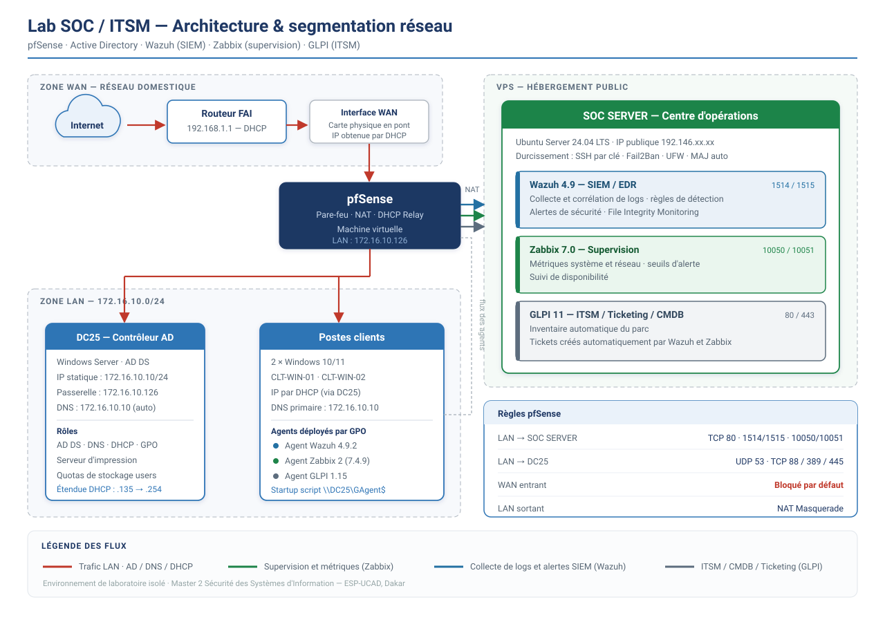
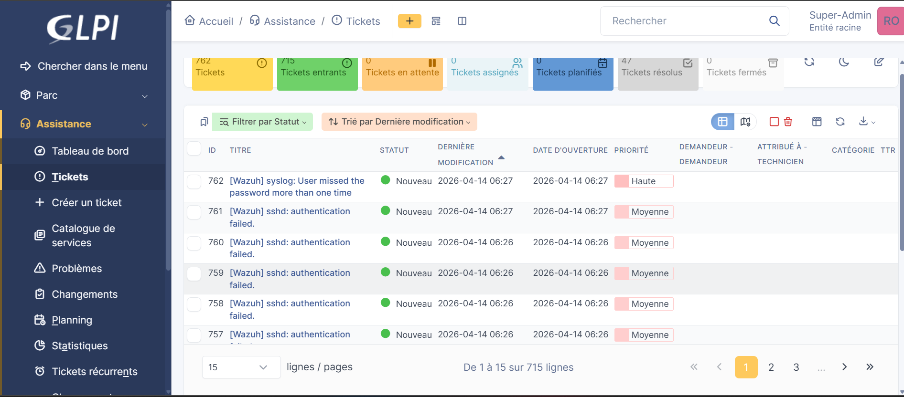

# 🛡️ Architecture & Sécurité d'un SI — Lab SOC / ITSM

> Conception, déploiement et exploitation d'une infrastructure complète avec segmentation réseau (pfSense), annuaire (Active Directory), supervision (Zabbix), SIEM/EDR (Wazuh) et ticketing automatisé (GLPI) — en environnement lab isolé.



---

## 🎯 Ce que ce lab démontre

| Domaine | Mise en pratique |
|---|---|
| **Détection & SIEM** | Wazuh 4.9 déployé sur parc Windows/Linux, collecte et corrélation de logs, alertes de sécurité |
| **Supervision** | Zabbix 7.0 — métriques, seuils, disponibilité, alertes |
| **Réponse à incident** | Chaîne complète alerte → ticket GLPI → suivi → résolution, entièrement automatisée |
| **Réseau & filtrage** | pfSense — segmentation, règles de pare-feu, NAT, DHCP Relay |
| **Annuaire & durcissement** | Active Directory, DNS, DHCP, GPO, sécurisation AD, quotas utilisateurs |
| **Automatisation** | Déploiement des agents par GPO, scripts PowerShell / Bash / Python |

---

## 📐 Architecture

```
                          [ INTERNET ]
                               |
                          [ pfSense ]
                         Firewall / Router
                               |
              ┌────────────────┼────────────────┐
              |                |                |
        [ DC25 ]         [ Clients ]      [ SOC SERVER ]
    Contrôleur AD        Win 10/11       Ubuntu 24.04 LTS
    172.16.10.10       172.16.16.x        Hébergé sur VPS
    DHCP / DNS / GPO   Agents déployés   Wazuh + Zabbix + GLPI
```

**Flux réseau**

- 🔴 Trafic LAN / AD / DNS / DHCP
- 🟢 Supervision et métriques (Zabbix) — ports 10050 / 10051
- 🔵 Collecte de logs et alertes SIEM (Wazuh) — ports 1514 / 1515
- ⬛ ITSM / CMDB / Ticketing (GLPI) — ports 80 / 443

**Règles pfSense (résumé)**

```
LAN → SOC SERVER : TCP 80, 1514/1515, 10050/10051
LAN → DC25       : UDP 53, TCP 88/389/445
WAN entrant      : Bloqué par défaut
LAN sortant      : NAT Masquerade
```

> 📄 Détail complet : [`config/pfsense/firewall-rules.md`](config/pfsense/firewall-rules.md)

---

## ✅ Services déployés

| Service | Rôle | Statut | Documentation |
|---|---|---|---|
| **pfSense** | Firewall / NAT / DHCP Relay | ✅ Opérationnel | [`config/pfsense/`](config/pfsense/) |
| **DC25 (AD DS)** | Active Directory / DNS / DHCP / GPO | ✅ Opérationnel | [`config/windows_server_AD/`](config/windows_server_AD/) |
| **Zabbix 7.0** | Supervision et monitoring | ✅ Opérationnel | [`config/zabbix/`](config/zabbix/) |
| **Wazuh 4.9** | SIEM / EDR / Alertes sécurité | ✅ Opérationnel | [`config/wazuh/`](config/wazuh/) |
| **GLPI 11** | ITSM / Ticketing / CMDB | ✅ Opérationnel | [`config/GLPI/`](config/GLPI/) |
| **VPS Ubuntu** | Hébergement du SOC Server, durci | ✅ Opérationnel | [`config/VPS/`](config/VPS/) |

---

## 🔗 Intégrations : de l'alerte au ticket

### Wazuh → GLPI — tickets de sécurité automatiques

Intégration via script Python sur le manager Wazuh. Chaque alerte de sécurité génère un ticket GLPI, avec priorité héritée du niveau de l'alerte.



*Exemple réel : tentatives d'authentification SSH échouées détectées par Wazuh et remontées automatiquement en tickets GLPI, horodatées et priorisées.*

> 📄 Configuration : [`config/Alertes/alertes_Wazuh_GLPI.md`](config/Alertes/alertes_Wazuh_GLPI.md)

### Zabbix → GLPI — tickets d'exploitation automatiques

Webhook GLPI configuré comme Media Type dans Zabbix : création du ticket à l'alerte, résolution automatique quand l'alerte se referme, et lien direct vers l'événement Zabbix depuis le ticket.

> 📄 Configuration : [`config/Alertes/Alertes_glpi_zabbix.md`](config/Alertes/Alertes_glpi_zabbix.md)

### GLPI — inventaire automatique

L'agent GLPI remonte l'inventaire complet de chaque poste, synchronisé au démarrage via GPO.

---

## 🔄 Déploiement des agents par GPO

Les trois agents sont déployés automatiquement sur tous les postes clients via une GPO Active Directory.

```
GPO     : Computer Configuration → Windows Settings → Scripts → Startup → PowerShell
Partage : \\DC25\GAgent$\
Agents  : GLPI Agent 1.15 + Wazuh 4.9.2 + Zabbix Agent 2 (7.4.9)
```

---

## 🔐 Durcissement du VPS

- SSH : authentification par clé uniquement, connexion root désactivée
- Fail2Ban : protection contre le brute-force — [`scripts/script _fail2Band.txt`](scripts/)
- UFW : restriction des ports exposés
- Mises à jour de sécurité automatiques

> 📄 Détail : [`config/VPS/Durcissement_VPS.md`](config/VPS/Durcissement_VPS.md)

---

## 📁 Structure du dépôt

```
Architecture-Securite-SI-Lab-SOC-ITSM/
├── architecture/
│   └── architecture-soc-segmentation.png
├── config/
│   ├── Alertes/
│   │   ├── alertes_Wazuh_GLPI.md
│   │   └── Alertes_glpi_zabbix.md
│   ├── GLPI/
│   │   ├── GLPI_SERVER.md
│   │   └── GLPI_AGENT.md
│   ├── pfsense/
│   │   ├── interfaces.md
│   │   ├── firewall-rules.md
│   │   ├── dhcp-relay.md
│   │   └── README.md
│   ├── Simulation_attaque/
│   │   └── configuration_vps_openvpn_kali.md
│   ├── VPS/
│   │   ├── VPS.md
│   │   └── Durcissement_VPS.md
│   ├── wazuh/
│   │   └── wazuh_server_agent.md
│   ├── windows_server_AD/
│   │   ├── Services-AD.md
│   │   ├── DNS.md
│   │   ├── DHCP.md
│   │   ├── securisation_AD.md
│   │   ├── print_server.md
│   │   └── limitations_stockage_users.md
│   └── zabbix/
│       ├── zabbix_server.md
│       └── zabbix_agent.md
├── docs/assets/          # 210 captures d'écran documentant chaque étape
├── scripts/
│   ├── GLPI_INSTALL_11.txt
│   ├── ZabbixInstallationLinux.bash
│   ├── Script_glpi_wazuh.txt
│   ├── script_ticket.txt
│   ├── script_fail2Band.txt
│   └── media_glpi.yaml
└── README.md
```

---

## 🚀 Installation rapide

```bash
# GLPI 11
cat scripts/GLPI_INSTALL_11.txt

# Zabbix sur Linux
bash scripts/ZabbixInstallationLinux.bash

# Agents Windows : déposer dans \\DC25\GAgent$\ puis configurer la GPO Startup Script
```

---

## 🚧 Roadmap

**Simulation d'attaques — validation des détections**
- [ ] Machine Kali Linux intégrée au lab
- [ ] Brute-force SSH/RDP → alerte Wazuh (règle 5710)
- [ ] Scan Nmap → alerte Wazuh + Zabbix
- [ ] Élévation de privilèges → alerte Wazuh
- [ ] Test EICAR → alerte Wazuh
- [ ] File Integrity Monitoring → alerte Wazuh

**VPN & accès distant**
- [ ] WireGuard sur pfSense

**Audit de l'infrastructure**
- [ ] Lynis — audit durcissement Linux
- [ ] BloodHound — audit des permissions Active Directory
- [ ] CIS Benchmark — conformité des postes Windows

**Dashboards**
- [ ] Grafana connecté à Zabbix

---

## 📝 À propos

Projet réalisé dans le cadre du Master 2 Sécurité des Systèmes d'Information (ESP-UCAD, Dakar), en environnement lab isolé, à des fins d'apprentissage.

**Jean Ngueyanouba** — [LinkedIn](https://www.linkedin.com/in/jean-ngueyanouba-66bb02286)
