# 🔔 Intégration Zabbix → GLPI — Alertes & Tickets automatiques

> **Environnement :** Zabbix 7.0.24 · GLPI `194.146.xx.xx` · Intégration via Media Type Webhook `media_glpi.yaml`

---

## ⚠️ Problème initial

La configuration par défaut du Media Type `media_glpi.yaml` crée les alertes Zabbix sous forme de **Problèmes** dans GLPI (`Assistance > Problèmes`) au lieu de **Tickets** (`Assistance > Tickets`). La Phase 1 documente la configuration complète. La Phase 2 documente la correction appliquée au script.

---

# PHASE 1 — Configuration initiale

## 1. Activation de l'API GLPI

**Chemin :** `Configuration > Générale > API`

Pour permettre à Zabbix de communiquer avec GLPI via webhook, l'API REST doit être activée.

**Étapes :**
1. Aller dans **Configuration** → **Générale**.
2. Cliquer sur l'onglet **API**.
3. Activer le toggle **Activer l'API**.
4. Activer le toggle **Activer l'API REST legacy**.
5. Cliquer sur **Sauvegarder**.

> 💡 L'**API Legacy** est indispensable car le script du Media Type Zabbix (`media_glpi.yaml`) utilise l'ancienne API REST de GLPI pour créer les éléments.

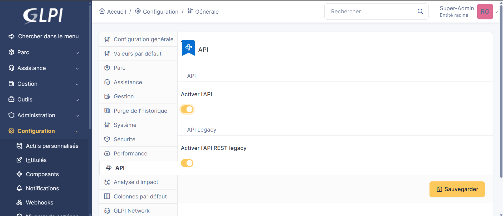

---

## 2. Création du client API Zabbix dans GLPI

**Chemin :** `Configuration > Générale > API > Clients de l'API > +`

Un client API dédié est créé pour autoriser les requêtes entrantes provenant du serveur Zabbix uniquement.

**Configuration du client :**

| Champ | Valeur |
|-------|--------|
| Nom | `Zabbix` |
| Activé | Oui |
| Enregistrer les connexions | Désactivé |
| Début de plage IPv4 | `194.146.xx.xx` |
| Fin de plage IPv4 | *(vide — IP unique)* |
| Regénérer (app_token) | ✅ Coché |

> ⚠️ L'IP `194.146.xx.xx` restreint l'accès API à cette source uniquement. Le **jeton d'application (app_token)** généré sera utilisé dans le paramètre `glpi_app_token` du Media Type Zabbix.

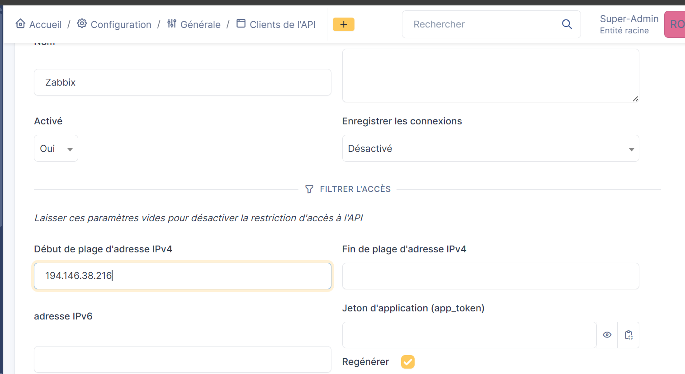

---

## 3. Liste des clients API enregistrés

**Chemin :** `Configuration > Générale > API > Clients API (API legacy)`

Après création, deux clients API sont présents dans GLPI :

| Nom | Description |
|-----|-------------|
| full access from localhost | Client par défaut (accès local uniquement) |
| **Zabbix** | Client créé pour l'intégration Zabbix |

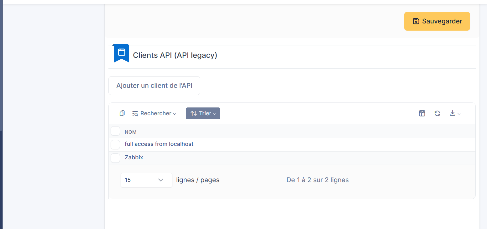

---

## 4. Récupération du jeton d'API utilisateur GLPI

**Chemin :** `Accueil > Mes préférences > Mot de passe et jeton d'accès`

Le **Jeton d'API** (user_token) de l'utilisateur Super-Admin est nécessaire pour authentifier les requêtes API de Zabbix vers GLPI.

**Étapes :**
1. Cliquer sur le profil **Super-Admin** en haut à droite.
2. Aller dans **Mes préférences**.
3. Descendre jusqu'à la section **Mot de passe et jeton d'accès**.
4. Copier la valeur du **Jeton d'API**.
5. Si besoin, cocher **Regénérer** puis **Sauvegarder** pour en créer un nouveau.

> 🔑 Ce jeton correspond au paramètre `glpi_user_token` dans la configuration du Media Type Zabbix.

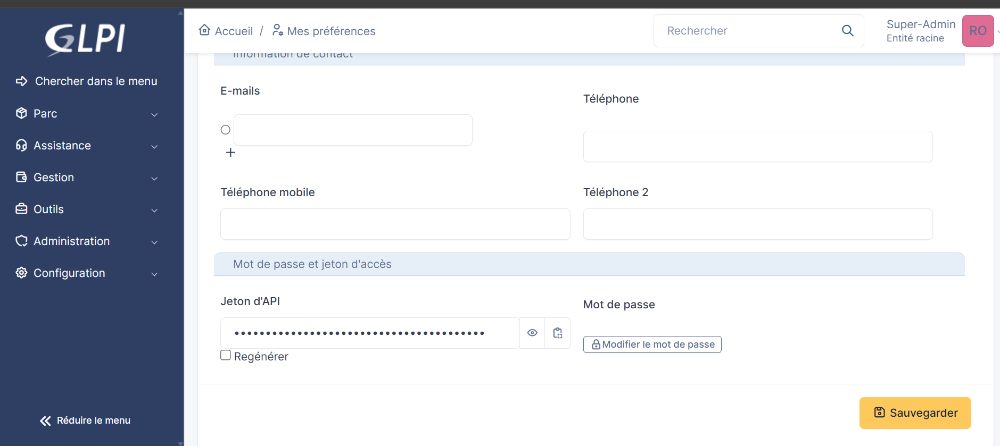

---

## 5. Import du Media Type GLPI dans Zabbix

**Chemin Zabbix :** `Alerts > Media types > Import`

Le fichier `media_glpi.yaml` est le connecteur officiel fourni par Zabbix pour l'intégration GLPI. Il est importé directement depuis l'interface Zabbix.

**Étapes :**
1. Dans Zabbix, aller dans **Alerts** → **Media types**.
2. Cliquer sur **Import** (bouton en haut à droite).
3. Sélectionner le fichier **`media_glpi.yaml`**.
4. Dans les règles, cocher **Create new** pour Media types.
5. Cliquer sur **Import**.

> 💡 Le fichier `media_glpi.yaml` est téléchargeable depuis le dépôt officiel Zabbix : `https://git.zabbix.com/projects/ZBX/repos/zabbix/browse/templates/media/glpi`


---

## 6. Configuration des paramètres du Media Type

**Chemin Zabbix :** `Alerts > Media types > GLPi > Media type`

Après import, le Media Type `GLPi` doit être renseigné avec les tokens GLPI et les URLs.

**Paramètres à configurer :**

| Paramètre | Valeur | Description |
|-----------|--------|-------------|
| `glpi_app_token` | `FSbET7LCH26sM5HsuZYXM3C2...` | App token du client API GLPI (étape 2) |
| `glpi_legacy_api` | `true` | Utiliser l'API legacy de GLPI |
| `glpi_problem_id` | `{EVENT.TAGS.__zbx_glpi_problem_id}` | Tag Zabbix portant l'ID du problème GLPI |
| `glpi_url` | `http://194.146.xx.xx` | URL de l'instance GLPI |
| `glpi_user_token` | `ynwq1W5uYm7G2KL9d1XEgcloV...` | User token GLPI (étape 4) |
| `trigger_id` | `{TRIGGER.ID}` | ID du trigger Zabbix déclencheur |
| `zabbix_url` | `http://194.146.xx.xx/zabbix` | URL de l'interface Zabbix |

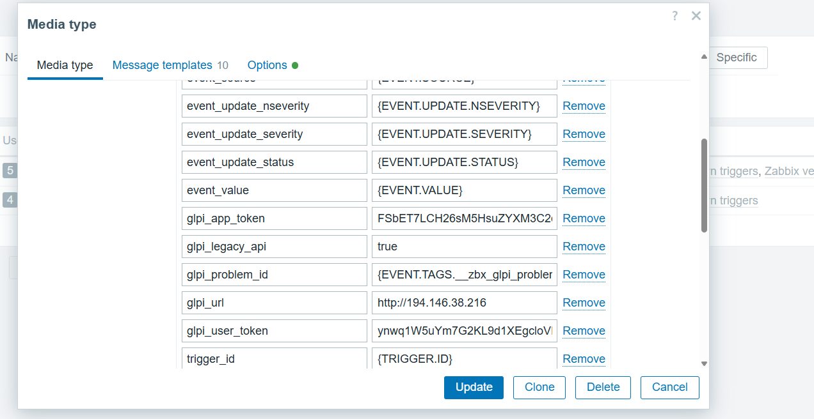

---

## 7. Configuration de la macro \{$ZABBIX.URL\}

**Chemin Zabbix :** `Administration > General > Macros`

La macro globale `{$ZABBIX.URL}` doit pointer vers l'URL de l'interface Zabbix pour que les liens dans les alertes envoyées à GLPI soient corrects et cliquables.

**Configuration :**

| Macro | Valeur |
|-------|--------|
| `{$ZABBIX.URL}` | `http://194.146.xx.xx/zabbix` |

**Étapes :**
1. Aller dans **Administration** → **General** → **Macros**.
2. Vérifier ou ajouter la macro `{$ZABBIX.URL}`.
3. Saisir l'URL complète de l'interface Zabbix.
4. Cliquer sur **Update**.

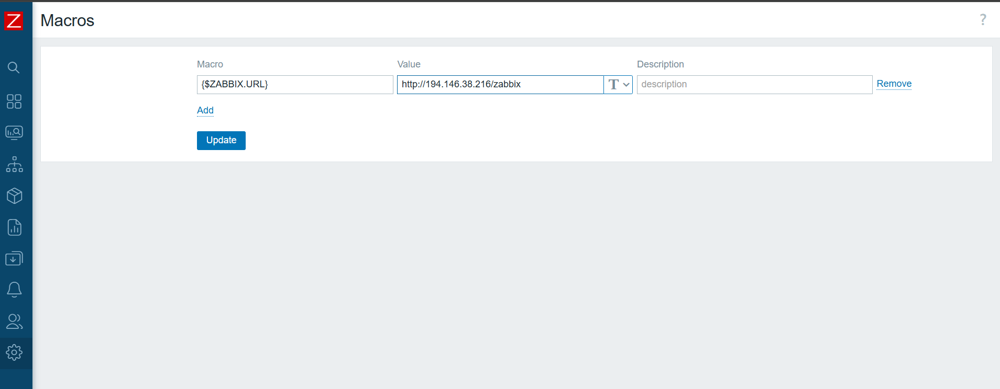

---

## 8. Paramètres avancés du Media Type (script & menu)

**Chemin Zabbix :** `Alerts > Media types > GLPi > Media type` *(partie inférieure)*

La partie basse de la configuration définit le comportement du webhook JavaScript et le lien de retour vers GLPI dans l'interface Zabbix.

**Paramètres configurés :**

| Paramètre | Valeur |
|-----------|--------|
| `zabbix_url` | `http://194.146.xx.xx/zabbix` |
| Script | `const CLogger = function(serviceName) {...` *(webhook JS)* |
| Timeout | `30s` |
| Process tags | ✅ |
| Include event menu entry | ✅ |
| Menu entry name | `GLPi: Problem {EVENT.TAGS.__zbx_glpi_problem_id}` |
| Menu entry URL | `{EVENT.TAGS.__zbx_glpi_link}` |
| Description | This media type integrates your Zabbix installation with your GLPi installation |

> 💡 Le **menu entry** ajoute un lien direct vers le problème/ticket GLPI correspondant dans la vue d'événement Zabbix, facilitant la navigation entre les deux outils.

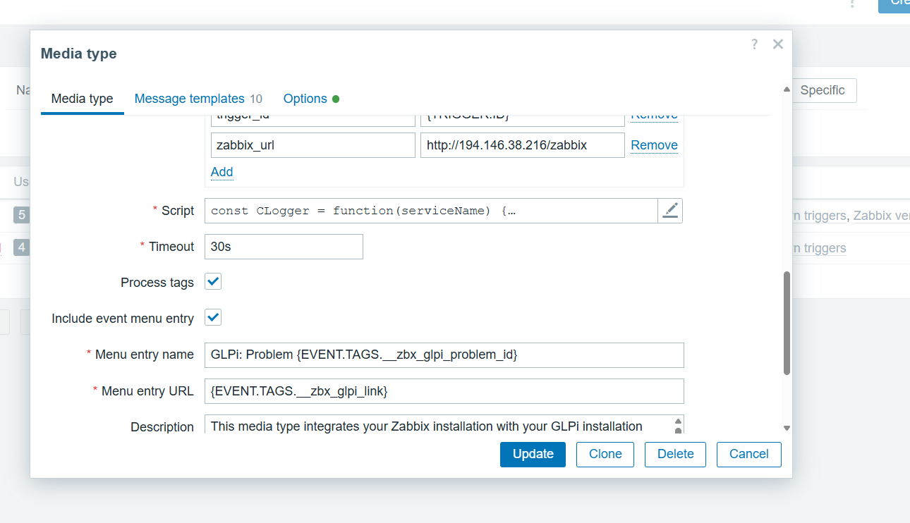

---

## 9. Création de l'utilisateur glpi-notify dans Zabbix

**Chemin Zabbix :** `Administration > Users > Create user`

Un utilisateur dédié `glpi-notify` est créé dans Zabbix. Il servira de relais pour l'acheminement des notifications vers GLPI via le Media Type.

**Configuration :**

| Champ | Valeur |
|-------|--------|
| Username | `glpi-notify` |
| Groups | Zabbix administrators |
| Language | System default |
| Time zone | (UTC+02:00) Europe/Paris |

> Cet utilisateur n'a pas de rôle de supervision actif — il est uniquement utilisé comme destinataire de média pour router les alertes vers GLPI.

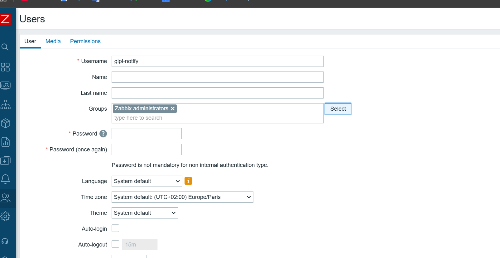

---

## 10. Permissions de l'utilisateur glpi-notify

**Onglet :** `Permissions` de l'utilisateur `glpi-notify`

Le rôle **Super admin role** est assigné à `glpi-notify` pour lui garantir un accès complet en lecture/écriture sur tous les hôtes et templates Zabbix.

| Champ | Valeur |
|-------|--------|
| Role | Super admin role |
| User type | Super admin |

**Permissions héritées :**

| Groupe | Type | Droits |
|--------|------|--------|
| All groups | Hosts | Read-write |
| All groups | Templates | Read-write |

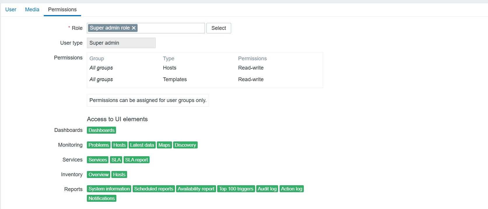

---

## 11. Association du Media GLPi à l'utilisateur

**Onglet :** `Media` de l'utilisateur `glpi-notify`

Le Media Type `GLPi` est associé à l'utilisateur pour définir les conditions d'envoi des alertes vers GLPI.

**Configuration du Media :**

| Paramètre | Valeur |
|-----------|--------|
| Type | `GLPi` |
| Send to | `GLPI` |
| When active | `1-7,00:00-24:00` (toujours actif, 7j/7 24h/24) |
| Use if severity | ✅ Not classified · Information · Warning · Average · High · Disaster |
| Enabled | ✅ |

> Toutes les sévérités sont cochées pour garantir qu'aucune alerte ne soit filtrée avant d'atteindre GLPI.

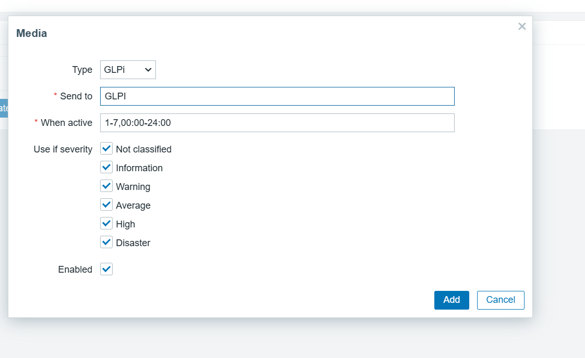

---

## 12. Test du Media Type — Résultat réussi

**Chemin Zabbix :** `Alerts > Media types > GLPi > Test`

Avant mise en production, le Media Type est testé avec des données fictives pour valider la connexion entre Zabbix et GLPI.

**Paramètres de test :**

| Paramètre | Valeur |
|-----------|--------|
| alert_message | `ceci est un test` |
| alert_subject | `Test Ticket depuis Zabbix` |
| event_id | `1` |
| event_nseverity | `3` |
| event_severity | `{EVENT.SEVERITY}` |
| event_source | `0` |

**Résultat :**

```
✅ Media type test successful.
```

> Le test confirme que les tokens (`glpi_user_token` et `glpi_app_token`) sont valides et que GLPI accepte bien les requêtes provenant de Zabbix.

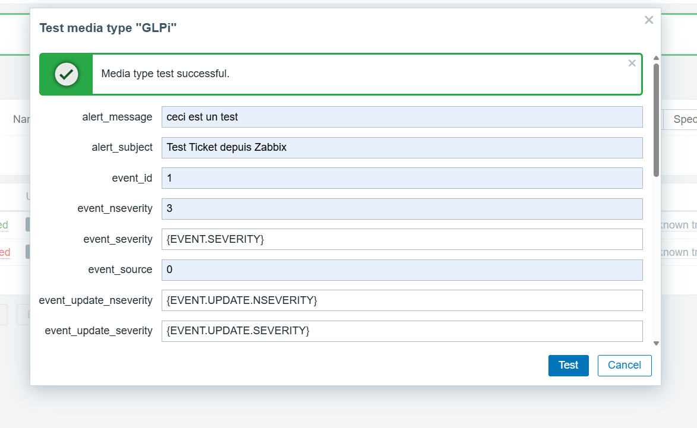

---

## 13. Résultat du test : alerte créée comme Problème dans GLPI

**Chemin GLPI :** `Assistance > Problèmes`

Suite au test, l'alerte est créée dans GLPI sous la section **Problèmes** — et non dans **Tickets** comme attendu.

| ID | Titre | Description | Statut | Date d'ouverture | Priorité |
|----|-------|-------------|--------|------------------|----------|
| 1 | Test Ticket depuis Zabbix | ceci est un test · Link to problem in Zabbix | 🟢 Nouveau | 2026-04-12 07:53 | Moyenne |

> ⚠️ **Comportement non souhaité** : l'alerte est créée dans `Assistance > Problèmes` au lieu de `Assistance > Tickets`. Ce comportement est dû au script JavaScript du Media Type qui appelle l'endpoint `/Problem/` de l'API GLPI. La correction sera appliquée en Phase 2.

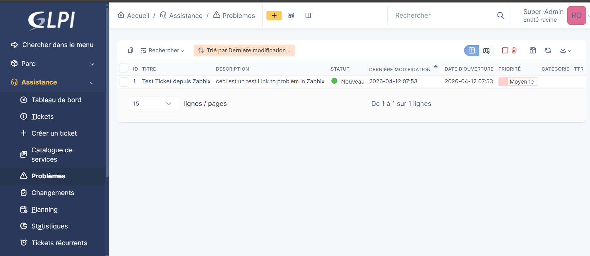

---

## 14. Création de l'action Trigger "Zabbix vers GLPI"

**Chemin Zabbix :** `Alerts > Actions > Trigger actions > Create action`

Une action Trigger est créée pour automatiser l'envoi de toutes les alertes Zabbix vers GLPI dès qu'un trigger se déclenche.

**Configuration :**

| Champ | Valeur |
|-------|--------|
| Name | `Zabbix vers GLPI` |
| Conditions | *(aucune — s'applique à tous les triggers)* |
| Enabled | ✅ |

> Sans conditions, l'action couvre **l'ensemble des triggers** de tous les hôtes. Des filtres (groupes d'hôtes, sévérité minimale, tags...) peuvent être ajoutés si nécessaire.

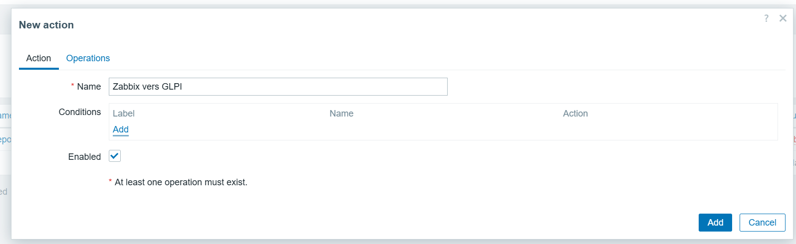

---

## 15. Détails de l'opération d'action

**Onglet :** `Operations` → `Operation details`

Chaque alerte déclenchée est transmise simultanément à l'utilisateur `glpi-notify` et au groupe `Zabbix administrators` via le Media Type `GLPi`.

**Configuration de l'opération :**

| Paramètre | Valeur |
|-----------|--------|
| Steps | 1 - 1 |
| Step duration | 0 (use action default) |
| Send to user groups | `Zabbix administrators` |
| Send to users | `glpi-notify` |
| Send to media type | **GLPi** |
| Custom message | ☐ Non |

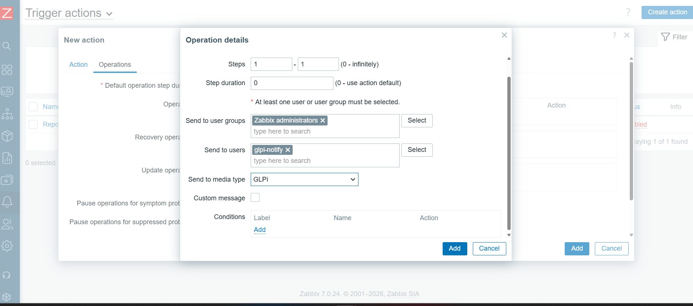

---

## 16. Récapitulatif des opérations de l'action

**Onglet :** `Operations 3`

Trois types d'opérations sont configurés pour couvrir tout le cycle de vie d'une alerte :

| Type d'opération | Déclenchement | Détails |
|------------------|---------------|---------|
| **Operations** | Immédiatement (alerte déclenchée) | Send to users: `glpi-notify` via GLPi · Send to groups: `Zabbix administrators` via GLPi |
| **Recovery operations** | Dès résolution de l'alerte | Send to users: `glpi-notify` via GLPi · Send to groups: `Zabbix administrators` via GLPi |
| **Update operations** | À chaque mise à jour | Send to users: `glpi-notify` via GLPi · Send to groups: `Zabbix administrators` via GLPi |

> La couverture des 3 types garantit que GLPI reçoit une notification à chaque changement d'état : déclenchement, résolution et mise à jour de l'alerte.

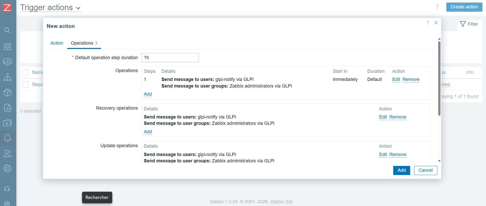

---

## 17. Constat Phase 1 — Alertes reçues comme Problèmes

**Chemin GLPI :** `Assistance > Problèmes`

Avec la configuration complète de la Phase 1, les vraies alertes Zabbix arrivent dans GLPI sous **Assistance > Problèmes**, confirmant le comportement non souhaité du script original.

**Exemple d'alerte reçue :**

| Champ | Valeur |
|-------|--------|
| Titre | `Resolved in 2m 0s: Windows: The Memory Pages/sec is too high (over 1000 for 5m)` |
| Host | CLIENT-03 |
| Severity | Warning |
| Operational data | 1317.374285 |
| Original problem ID | 2695 |
| Résolution | Problem has been resolved in 2m 0s at 06:35:23 on 2026.04.12 |

> Le lien **"Link to problem in Zabbix"** inclus dans la description permet de naviguer directement vers l'événement d'origine dans Zabbix. L'indicateur **1/5** indique 5 alertes reçues — toutes sous forme de Problèmes. **→ Correction requise en Phase 2.**

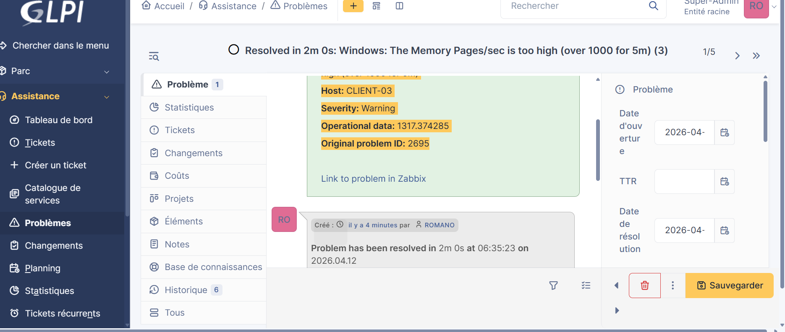
---

# PHASE 2 — Correction : alertes sous forme de Tickets

## Problème identifié

Le script JavaScript du Media Type `GLPi` appelle l'endpoint `/Problem/` de l'API GLPI au lieu de `/Ticket/`. La correction consiste à modifier uniquement le script — toute la configuration (paramètres, tokens, macro, utilisateur, action) reste inchangée.

---

## 18. Correction du script Media Type

**Chemin Zabbix :** `Alerts > Media types > GLPi > Media type > Script` *(icône édition)*

Le script JavaScript est remplacé par la version corrigée disponible dans le dossier `scripts/` du projet.

**Modification clé dans le script :**

```javascript
// AVANT — créait des Problèmes dans GLPI
const endpoint = glpi_url + '/apirest.php/Problem/';

// APRÈS — crée des Tickets dans GLPI
const endpoint = glpi_url + '/apirest.php/Ticket/';
```

**Étapes pour appliquer la correction :**
1. Dans Zabbix, aller dans **Alerts** → **Media types** → **GLPi**.
2. Cliquer sur l'icône **édition** du champ **Script**.
3. Remplacer le contenu par le script corrigé (`scripts/media_glpi_fixed.js`).
4. Cliquer sur **Update**.

> 💡 Aucune autre modification n'est nécessaire — les paramètres, tokens, macro, utilisateur `glpi-notify` et action `Zabbix vers GLPI` restent identiques.


---

## 20. Vérification de l'envoi — Event details Zabbix

**Chemin Zabbix :** `Monitoring > Problems > [événement] > Event details`

Après correction du script, les **Event details** d'un événement réel confirment que le webhook est bien déclenché et que le message est transmis à GLPI.

**Détails du trigger :**

| Champ | Valeur |
|-------|--------|
| Host | CLIENT-02 |
| Trigger | Windows: Zabbix agent is not available |
| Severity | Average |
| Problem expression | `nodata(/CLIENT-02/agent.ping,30m)=1` |
| Event generation | Normal |
| Allow manual close | Yes |
| Enabled | Yes |

**Journal des actions (section Actions) :**

| Step | Time | User/Recipient | Statut |
|------|------|----------------|--------|
| 1 | 2026-04-13 08:28:27 | Admin (Zabbix Administrator) | ❌ Failed |
| 1 | 2026-04-13 08:28:27 | **glpi-notify · GLPI** | ✅ **Sent** |

> ℹ️ L'envoi à `Admin` échoue car cet utilisateur n'a pas de Media GLPi configuré. L'envoi via `glpi-notify` est bien **Sent** → le ticket est créé dans GLPI avec succès.


---

## 21. Dashboard GLPI — Vue globale

**Chemin :** `Accueil` (tableau de bord GLPI)

Le dashboard GLPI reflète l'activité réelle générée par l'intégration Zabbix après correction :

**Parc informatique :**

| Catégorie | Nombre |
|-----------|--------|
| Logiciels | 176 |
| Ordinateurs | 4 |
| Matériel réseau | 0 |
| Téléphone | 0 |

**Assistance :**

| Indicateur | Valeur |
|-----------|--------|
| **Tickets** | **51** |
| Tickets en retard | 0 |
| Problèmes | 13 |
| Changements | 0 |

> Les **51 tickets** sont générés automatiquement par Zabbix. Le graphique **Statuts des tickets par mois** montre un pic en avril 2026 avec une majorité de tickets **Résolus** (vert) et **Nouveaux** (bleu) — preuve que les Recovery operations fonctionnent aussi.


---

## 22. Liste des tickets générés automatiquement

**Chemin GLPI :** `Assistance > Tickets`

Après correction, les alertes Zabbix arrivent bien dans **Assistance > Tickets**. Les 51 tickets sont tous issus de l'intégration automatique.

**Exemples de tickets générés :**

| ID | Titre | Statut | Date | Priorité |
|----|-------|--------|------|----------|
| 51 | Problem: Windows: Zabbix agent is not available (or nodata for 30m) | 🟢 Nouveau | 2026-04-13 20:28 | Moyenne |
| 50 | Problem: Windows: Active checks are not available | 🟢 Nouveau | 2026-04-13 20:04 | **Haute** |
| 45 | Resolved in 7m 30s: Windows: Host has been restarted (uptime < 10m) | ⚪ Résolu | 2026-04-13 19:38 | Basse |
| 49 | Resolved in 1m 0s: Windows: "WazuhSvc" (Wazuh) is not running | ⚪ Résolu | 2026-04-13 19:36 | Moyenne |
| 48 | Problem: Windows: "SgrmBroker" is not running (startup type automatic delayed) | 🟢 Nouveau | 2026-04-13 19:32 | Moyenne |

> Les tickets **Résolus** confirment que les **Recovery operations** de l'action Zabbix fonctionnent correctement — GLPI est notifié lors de la résolution.


---

## 23. Détail d'un ticket Zabbix dans GLPI

**Chemin GLPI :** `Assistance > Tickets > Ticket #51`

Chaque ticket généré contient toutes les informations de l'alerte Zabbix dans sa description :

**Contenu du ticket #51 :**

```
Problem: Windows: Zabbix agent is not available (or nodata for 30m)

Problem started at 20:28:27 on 2026.04.13
Problem name: Windows: Zabbix agent is not available (or nodata for 30m)
Host: CLIENT-02
Severity: Average
Operational data: Up (1)
Original problem ID: 3509
```

**Métadonnées :**

| Champ | Valeur |
|-------|--------|
| Type | Incident |
| Statut | 🟢 Nouveau |
| Date d'ouverture | 2026-04-13 |
| Catégorie | — |

> Le type **Incident** est approprié pour des alertes de supervision. La description inclut toutes les données Zabbix nécessaires à l'investigation, ainsi qu'un lien de retour vers l'événement dans Zabbix.


---

## Fichiers de configuration

| Fichier | Description |
|---------|-------------|
| `media_glpi.yaml` | Media Type officiel Zabbix pour GLPI (import initial) |
| `scripts/media_glpi_fixed.js` | Script JavaScript corrigé (endpoint `/Ticket/` au lieu de `/Problem/`) |

---
