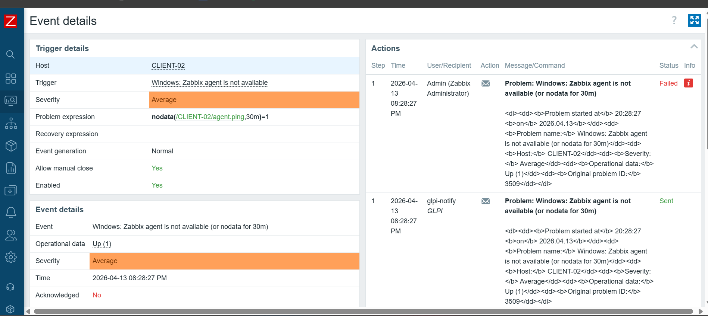
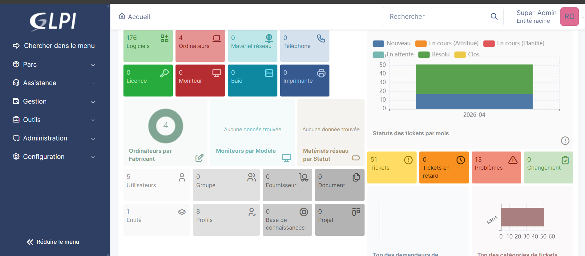
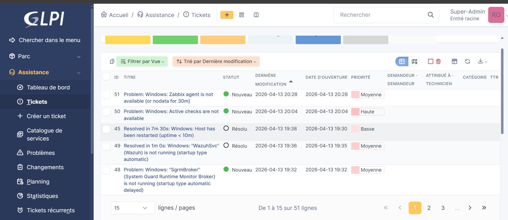

# 🔔 Intégration Zabbix → GLPI — Alertes & Tickets automatiques

> **Environnement :** Zabbix 7.0.24 · GLPI `194.146.38.216` · Intégration via Media Type Webhook `media_glpi.yaml`

---


## ⚠️ Problème initial

La configuration de base du Media Type `media_glpi.yaml` crée les alertes Zabbix sous forme de **Problèmes** dans GLPI (`Assistance > Problèmes`) au lieu de **Tickets** (`Assistance > Tickets`). Les étapes de la Phase 1 documentent cette configuration initiale. La Phase 2 documente la correction appliquée.

---

# PHASE 1 — Alertes sous forme de Problèmes

## 1. Résultat initial : alertes créées comme Problèmes dans GLPI

**Chemin GLPI :** `Assistance > Problèmes`

Avec la configuration initiale du Media Type, les alertes Zabbix arrivent dans GLPI sous la section **Problèmes** et non dans les **Tickets**. Le problème ci-dessous provient du trigger Zabbix sur `CLIENT-03`.

**Détails de l'alerte reçue :**

| Champ | Valeur |
|-------|--------|
| Titre | `Windows: The Memory Pages/sec is too high (over 1000 for 5m)` |
| Host | CLIENT-03 |
| Severity | Warning |
| Operational data | 1317.374285 |
| Original problem ID | 2695 |
| Résolu en | 2m 0s à 06:35:23 le 2026-04-12 |

> ℹ️ Le lien **"Link to problem in Zabbix"** permet de naviguer directement vers le problème d'origine dans l'interface Zabbix.


---

## 2. Activation de l'API GLPI

**Chemin :** `Configuration > Générale > API`

Pour permettre à Zabbix de communiquer avec GLPI, l'API REST doit être activée.

**Étapes :**
1. Aller dans **Configuration** → **Générale**.
2. Cliquer sur l'onglet **API**.
3. Activer le toggle **Activer l'API**.
4. Activer le toggle **Activer l'API REST legacy**.
5. Cliquer sur **Sauvegarder**.

> 💡 L'API Legacy est nécessaire car le Media Type Zabbix fourni (`media_glpi.yaml`) utilise l'ancienne API REST de GLPI.


---

## 3. Création du client API Zabbix dans GLPI

**Chemin :** `Configuration > Générale > API > Clients de l'API`

Un client API dédié est créé pour autoriser les requêtes provenant du serveur Zabbix.

**Configuration du client :**

| Champ | Valeur |
|-------|--------|
| Nom | `Zabbix` |
| Activé | Oui |
| Enregistrer les connexions | Désactivé |
| Début de plage IPv4 | `194.146.38.216` |
| Fin de plage IPv4 | *(vide — IP unique)* |
| Regénérer (app_token) | ✅ Coché |

> ⚠️ Renseigner l'IP du serveur Zabbix dans la plage d'adresses pour restreindre l'accès à l'API à cette source uniquement. Le **jeton d'application (app_token)** généré sera utilisé dans les paramètres du Media Type Zabbix.


---

## 4. Liste des clients API enregistrés

**Chemin :** `Configuration > Générale > API > Clients API (API legacy)`

Après création, deux clients API sont présents :

| Nom | Description |
|-----|-------------|
| full access from localhost | Client par défaut (accès local) |
| **Zabbix** | Client créé pour l'intégration Zabbix |


---

## 5. Récupération du jeton d'API utilisateur GLPI

**Chemin :** `Accueil > Mes préférences > Mot de passe et jeton d'accès`

Le **Jeton d'API** (user_token) de l'utilisateur Super-Admin est nécessaire pour authentifier les requêtes Zabbix vers GLPI.

**Étapes :**
1. Cliquer sur le profil utilisateur en haut à droite → **Mes préférences**.
2. Descendre jusqu'à la section **Mot de passe et jeton d'accès**.
3. Copier la valeur du champ **Jeton d'API**.
4. Si nécessaire, cocher **Regénérer** puis **Sauvegarder** pour obtenir un nouveau jeton.

> 🔑 Ce jeton correspond au paramètre `glpi_user_token` dans le Media Type Zabbix.


---

## 6. Import du Media Type GLPI dans Zabbix

**Chemin Zabbix :** `Alerts > Media types > Import`

Le fichier de configuration officiel `media_glpi.yaml` est fourni par Zabbix pour l'intégration avec GLPI. Il est importé directement dans Zabbix.

**Étapes :**
1. Dans Zabbix, aller dans **Alerts** → **Media types**.
2. Cliquer sur **Import** (bouton en haut à droite).
3. Sélectionner le fichier **`media_glpi.yaml`**.
4. Dans les règles, cocher **Create new** pour Media types.
5. Cliquer sur **Import**.

> 💡 Le fichier `media_glpi.yaml` est disponible dans le dépôt officiel Zabbix ou dans le dossier `integrations/` de l'installation Zabbix.


---

## 7. Configuration des paramètres du Media Type

**Chemin Zabbix :** `Alerts > Media types > GLPi > Media type`

Après import, le Media Type `GLPi` doit être configuré avec les tokens et l'URL de l'instance GLPI.

**Paramètres clés à renseigner :**

| Paramètre | Valeur | Description |
|-----------|--------|-------------|
| `glpi_app_token` | `FSbET7LCH26sM5HsuZYXM3C2...` | App token du client API GLPI |
| `glpi_legacy_api` | `true` | Utiliser l'API legacy GLPI |
| `glpi_problem_id` | `{EVENT.TAGS.__zbx_glpi_problem_id}` | ID du problème GLPI lié |
| `glpi_url` | `http://194.146.38.216` | URL de l'instance GLPI |
| `glpi_user_token` | `ynwq1W5uYm7G2KL9d1XEgcloV...` | User token GLPI (Mes préférences) |
| `trigger_id` | `{TRIGGER.ID}` | ID du trigger Zabbix |
| `zabbix_url` | `http://194.146.38.216/zabbix` | URL de l'interface Zabbix |


---

## 8. Configuration de la macro \{$ZABBIX.URL\}

**Chemin Zabbix :** `Administration > General > Macros`

La macro globale `{$ZABBIX.URL}` doit pointer vers l'URL de l'interface Zabbix pour que les liens dans les alertes GLPI soient corrects.

**Configuration :**

| Macro | Valeur |
|-------|--------|
| `{$ZABBIX.URL}` | `http://194.146.38.216/zabbix` |

**Étapes :**
1. Aller dans **Administration** → **General** → **Macros**.
2. Ajouter ou modifier la macro `{$ZABBIX.URL}`.
3. Saisir l'URL complète de l'interface Zabbix.
4. Cliquer sur **Update**.


---

## 9. Paramètres avancés du Media Type (script & menu)

**Chemin Zabbix :** `Alerts > Media types > GLPi > Media type`

La partie inférieure de la configuration du Media Type définit le comportement du webhook et le lien vers GLPI dans le menu d'événements Zabbix.

**Paramètres configurés :**

| Paramètre | Valeur |
|-----------|--------|
| Script | `const CLogger = function(serviceName) {...` *(script JavaScript du webhook)* |
| Timeout | `30s` |
| Process tags | ✅ Activé |
| Include event menu entry | ✅ Activé |
| Menu entry name | `GLPi: Problem {EVENT.TAGS.__zbx_glpi_problem_id}` |
| Menu entry URL | `{EVENT.TAGS.__zbx_glpi_link}` |
| Description | This media type integrates your Zabbix installation with your GLPi installation |

> 💡 Le menu entry permet d'afficher un lien direct vers le problème/ticket GLPI depuis la vue d'événement dans Zabbix.


---

## 10. Création de l'utilisateur glpi-notify dans Zabbix

**Chemin Zabbix :** `Administration > Users > Create user`

Un utilisateur dédié `glpi-notify` est créé dans Zabbix pour être le destinataire des notifications envoyées vers GLPI.

**Configuration de l'utilisateur :**

| Champ | Valeur |
|-------|--------|
| Username | `glpi-notify` |
| Groups | Zabbix administrators |
| Language | System default |
| Time zone | (UTC+02:00) Europe/Paris |

> Cet utilisateur servira de relais pour l'envoi des alertes via le Media Type GLPi.


---

## 11. Permissions de l'utilisateur glpi-notify

**Onglet :** `Permissions` de l'utilisateur `glpi-notify`

**Rôle assigné :** `Super admin role`

| Groupe | Type | Permissions |
|--------|------|-------------|
| All groups | Hosts | Read-write |
| All groups | Templates | Read-write |

L'accès complet à l'interface Zabbix (Dashboards, Monitoring, Services, Inventory, Reports) est accordé via le rôle Super admin.


---

## 12. Association du Media GLPi à l'utilisateur

**Onglet :** `Media` de l'utilisateur `glpi-notify`

Le Media Type GLPi est associé à l'utilisateur `glpi-notify` pour définir les conditions d'envoi des alertes.

**Configuration du Media :**

| Paramètre | Valeur |
|-----------|--------|
| Type | `GLPi` |
| Send to | `GLPI` |
| When active | `1-7,00:00-24:00` (toujours actif) |
| Use if severity | ✅ Not classified, Information, Warning, Average, High, Disaster |
| Enabled | ✅ |

> Toutes les sévérités sont activées pour s'assurer qu'aucune alerte ne soit manquée.


---

## 13. Test du Media Type — Résultat réussi

**Chemin Zabbix :** `Alerts > Media types > GLPi > Test`

Avant de déployer en production, le Media Type est testé avec des données de test.

**Paramètres de test utilisés :**

| Paramètre | Valeur |
|-----------|--------|
| alert_message | `ceci est un test` |
| alert_subject | `Test Ticket depuis Zabbix` |
| event_id | `1` |
| event_nseverity | `3` |

**Résultat :**

```
✅ Media type test successful.
```

> Le test confirme que la connexion entre Zabbix et GLPI est fonctionnelle et que les credentials (tokens) sont corrects.


---

## 14. Ticket de test créé dans GLPI

**Chemin GLPI :** `Assistance > Problèmes`

Suite au test, un premier élément est créé dans GLPI :

| ID | Titre | Description | Statut | Date d'ouverture | Priorité |
|----|-------|-------------|--------|------------------|----------|
| 1 | Test Ticket depuis Zabbix | ceci est un test · Link to problem in Zabbix | Nouveau | 2026-04-12 07:53 | Moyenne |

> ⚠️ L'élément est créé dans **Problèmes** et non dans **Tickets** — c'est le comportement qui sera corrigé en Phase 2.


---

## 15. Création de l'action Trigger "Zabbix vers GLPI"

**Chemin Zabbix :** `Alerts > Actions > Trigger actions > Create action`

Une action est créée pour automatiser l'envoi de toutes les alertes Zabbix vers GLPI via le Media Type configuré.

**Configuration de l'action :**

| Champ | Valeur |
|-------|--------|
| Name | `Zabbix vers GLPI` |
| Conditions | *(aucune — s'applique à tous les triggers)* |
| Enabled | ✅ |

> Sans conditions, l'action s'applique à **toutes** les alertes Zabbix. Des filtres peuvent être ajoutés pour cibler des hosts, groupes ou sévérités spécifiques.


---

## 16. Détails de l'opération d'action

**Onglet :** `Operations` de l'action `Zabbix vers GLPI`

**Operation details :**

| Paramètre | Valeur |
|-----------|--------|
| Steps | 1 - 1 |
| Step duration | 0 (use action default) |
| Send to user groups | `Zabbix administrators` |
| Send to users | `glpi-notify` |
| Send to media type | **GLPi** |
| Custom message | ☐ Non |

> Les notifications sont envoyées simultanément au groupe `Zabbix administrators` ET à l'utilisateur `glpi-notify` via le Media Type GLPi.


---

## 17. Récapitulatif des opérations de l'action

**Onglet :** `Operations 3` de l'action `Zabbix vers GLPI`

Trois types d'opérations sont configurés pour couvrir tout le cycle de vie d'une alerte :

| Type | Détails |
|------|---------|
| **Operations** (alerte déclenchée) | Send message to users: `glpi-notify` via GLPi · Send message to user groups: `Zabbix administrators` via GLPi · Déclenchement : Immédiatement |
| **Recovery operations** (alerte résolue) | Send message to users: `glpi-notify` via GLPi · Send message to user groups: `Zabbix administrators` via GLPi |
| **Update operations** (mise à jour) | Send message to users: `glpi-notify` via GLPi · Send message to user groups: `Zabbix administrators` via GLPi |

> La configuration des 3 types d'opérations garantit que GLPI reçoit une notification à chaque changement d'état de l'alerte (déclenchement, résolution, mise à jour).


---

# PHASE 2 — Correction : alertes sous forme de Tickets

## Problème identifié

Avec la configuration par défaut du fichier `media_glpi.yaml`, les alertes Zabbix sont créées dans GLPI sous **Assistance > Problèmes** au lieu d'**Assistance > Tickets**. Ce comportement est dû au script JavaScript du webhook qui utilise l'endpoint `Problem` de l'API GLPI.

**Correction appliquée :** Le script du Media Type est modifié pour cibler l'endpoint `Ticket` de l'API GLPI.

---

## 18. Correction du script Media Type

**Chemin Zabbix :** `Alerts > Media types > GLPi > Media type > Script`

Le script JavaScript du Media Type est corrigé pour que les alertes soient créées en tant que **Tickets** dans GLPI.

**Modification appliquée dans le script :**

Le script corrigé se trouve dans le dossier `scripts/` du projet. La modification principale consiste à remplacer l'appel API `Problem` par `Ticket` :

```javascript
// AVANT (créait des Problèmes)
const endpoint = glpi_url + '/apirest.php/Problem/';

// APRÈS (crée des Tickets)
const endpoint = glpi_url + '/apirest.php/Ticket/';
```

**Étapes pour appliquer la correction :**
1. Dans Zabbix, aller dans **Alerts** → **Media types** → **GLPi**.
2. Cliquer sur l'icône d'édition du champ **Script**.
3. Remplacer le contenu par le script corrigé (disponible dans `scripts/media_glpi_fixed.js`).
4. Cliquer sur **Update**.

> 💡 Le reste de la configuration (paramètres, tokens, macro, utilisateur, action) reste inchangé — seul le script est modifié.


---

## 19. Vérification de l'envoi — Event details Zabbix

**Chemin Zabbix :** `Monitoring > Problems > [problème] > Event details`

Après correction, les **Event details** confirment que le message est bien envoyé à l'utilisateur `glpi-notify` via le Media Type GLPI.

**Détails du trigger :**

| Champ | Valeur |
|-------|--------|
| Host | CLIENT-02 |
| Trigger | Windows: Zabbix agent is not available |
| Severity | Average |
| Problem expression | `nodata(/CLIENT-02/agent.ping,30m)=1` |
| Allow manual close | Yes |

**Journal des actions :**

| Step | Time | User/Recipient | Statut |
|------|------|----------------|--------|
| 1 | 2026-04-13 08:28:27 | Admin (Zabbix Administrator) | ❌ Failed |
| 1 | 2026-04-13 08:28:27 | **glpi-notify · GLPI** | ✅ **Sent** |

> ℹ️ L'envoi à `Admin` échoue car cet utilisateur n'a pas de Media GLPi configuré, mais l'envoi via `glpi-notify` est bien **Sent**, confirmant la bonne transmission vers GLPI.



---

## 20. Dashboard GLPI — Vue globale

**Chemin :** `Accueil` (tableau de bord GLPI)

Le dashboard GLPI reflète l'activité générée par l'intégration Zabbix en production réelle :

**Parc informatique :**

| Catégorie | Nombre |
|-----------|--------|
| Logiciels | 176 |
| **Ordinateurs** | **4** |
| Matériel réseau | 0 |
| Téléphone | 0 |

**Assistance :**

| Indicateur | Valeur |
|-----------|--------|
| **Tickets** | **51** |
| Tickets en retard | 0 |
| **Problèmes** | **13** |
| Changements | 0 |

> Les **51 tickets** sont majoritairement générés automatiquement par l'intégration Zabbix. Le graphique **Statuts des tickets par mois** montre un pic d'activité en avril 2026 avec une majorité de tickets **Résolus** (vert) et **Nouveaux** (bleu).



---

## 21. Liste des tickets générés automatiquement

**Chemin GLPI :** `Assistance > Tickets`

Après correction du script, les alertes Zabbix arrivent bien en tant que **Tickets** dans GLPI. Les 51 tickets affichés sont tous issus de l'intégration Zabbix automatique.

**Exemples de tickets générés :**

| ID | Titre | Statut | Date | Priorité |
|----|-------|--------|------|----------|
| 51 | Problem: Windows: Zabbix agent is not available (or nodata for 30m) | 🟢 Nouveau | 2026-04-13 20:28 | Moyenne |
| 50 | Problem: Windows: Active checks are not available | 🟢 Nouveau | 2026-04-13 20:04 | **Haute** |
| 45 | Resolved in 7m 30s: Windows: Host has been restarted (uptime < 10m) | ⚪ Résolu | 2026-04-13 19:38 | Basse |
| 49 | Resolved in 1m 0s: Windows: "WazuhSvc" (Wazuh) is not running | ⚪ Résolu | 2026-04-13 19:36 | Moyenne |
| 48 | Problem: Windows: "SgrmBroker" (System Guard Runtime Monitor Broker) is not running | 🟢 Nouveau | 2026-04-13 19:32 | Moyenne |

> Les tickets **Résolus** indiquent que Zabbix envoie également les notifications de **Recovery** à GLPI (opérations de récupération configurées dans l'action).


---

## 22. Détail d'un ticket Zabbix dans GLPI

**Chemin GLPI :** `Assistance > Tickets > Ticket #51`

Chaque ticket créé automatiquement contient toutes les informations du problème Zabbix :

**Ticket #51 — Contenu :**

```
Problem: Windows: Zabbix agent is not available (or nodata for 30m)

Problem started at 20:28:27 on 2026.04.13
Problem name: Windows: Zabbix agent is not available (or nodata for 30m)
Host: CLIENT-02
Severity: Average
Operational data: Up (1)
Original problem ID: 3509
```

**Métadonnées du ticket :**

| Champ | Valeur |
|-------|--------|
| Type | Incident |
| Statut | 🟢 Nouveau |
| Date d'ouverture | 2026-04-13 |
| Catégorie | — |

> Le ticket est de type **Incident**, ce qui est cohérent avec des alertes de supervision. Le lien de retour vers Zabbix est inclus dans la description pour faciliter l'investigation.


---

## Fichiers de configuration

| Fichier | Description |
|---------|-------------|
| `media_glpi.yaml` | Media Type officiel Zabbix pour GLPI (import initial) |
| `scripts/media_glpi_fixed.js` | Script JavaScript corrigé (endpoint Ticket au lieu de Problem) |

---
