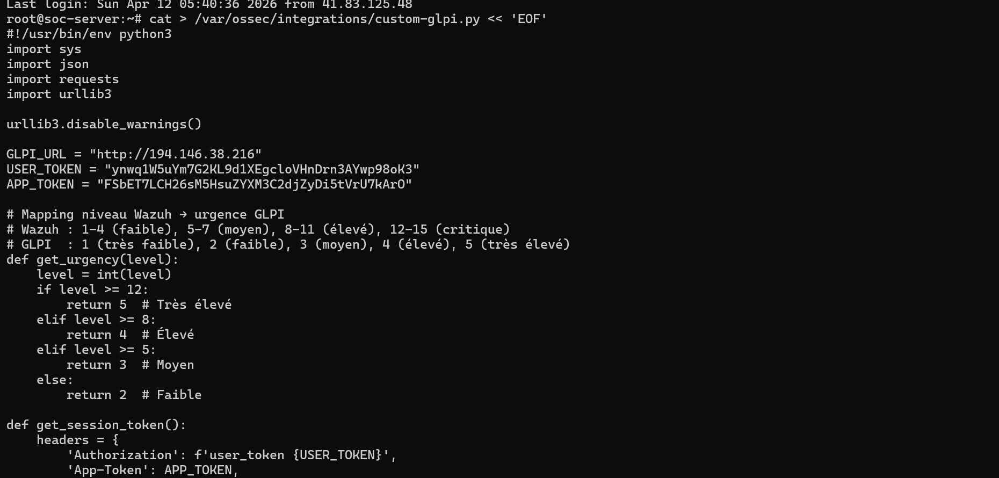
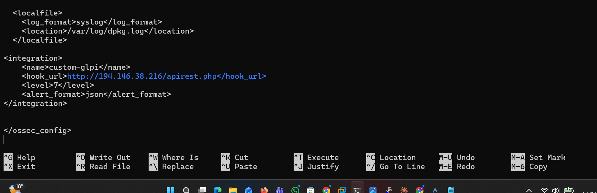
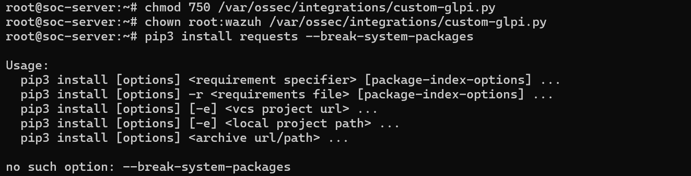
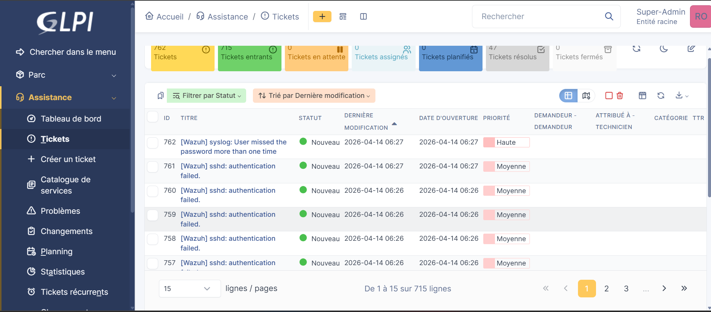
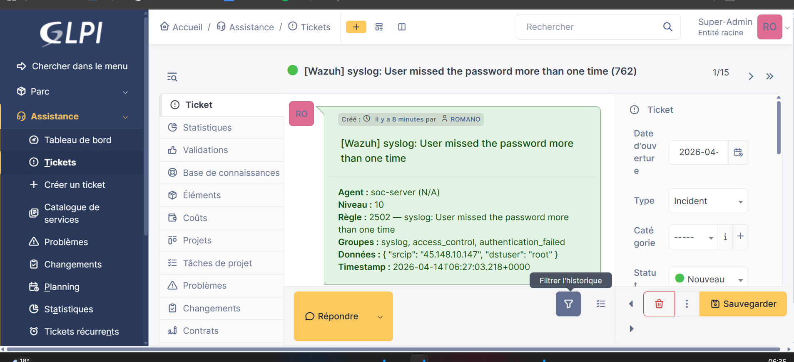

# 🚨 Intégration Wazuh → GLPI — Alertes de sécurité en Tickets automatiques

> **Environnement :** Wazuh Manager (`soc-server`) · GLPI `194.146.xx.xx` · Script Python `custom-glpi.py` · API REST GLPI Legacy

---


## Prérequis

Avant de configurer cette intégration, s'assurer que :
- L'**API REST GLPI** et l'**API Legacy** sont activées (`Configuration > Générale > API`)
- Un **client API** avec l'IP du `soc-server` est créé dans GLPI
- Le **user_token** et l'**app_token** GLPI sont disponibles
- Le service **Wazuh Manager** est opérationnel sur `soc-server`

---

## 1. Création du script d'intégration custom-glpi.py

**Serveur :** `root@soc-server`  
**Chemin :** `/var/ossec/integrations/custom-glpi.py`

Le script Python est créé directement sur le serveur Wazuh via un heredoc. Il assure la réception des alertes Wazuh et leur transmission à l'API GLPI sous forme de tickets.

**Commande de création :**

```bash
cat > /var/ossec/integrations/custom-glpi.py << 'EOF'
#!/usr/bin/env python3
import sys
import json
import requests
import urllib3
...
EOF
```

**Structure du script :**

```python
#!/usr/bin/env python3
import sys
import json
import requests
import urllib3

urllib3.disable_warnings()

GLPI_URL    = "http://194.146.xx.xx"
USER_TOKEN  = "ynwq1W5uYm7G2KL9d1XEgcloVHnDrn3AYwp98oK3"
APP_TOKEN   = "FSbET7LCH26sM5HsuZYXM3C2djZyDi5tVrU7kAr0"
```

**Mapping des niveaux de sévérité Wazuh → urgence GLPI :**

| Niveau Wazuh | Description | Urgence GLPI | Label |
|:------------:|-------------|:------------:|-------|
| 1 – 4 | Faible | 2 | Faible |
| 5 – 7 | Moyen | 3 | Moyen |
| 8 – 11 | Élevé | 4 | Élevé |
| ≥ 12 | Critique | 5 | Très élevé |

```python
def get_urgency(level):
    level = int(level)
    if level >= 12:
        return 5  # Très élevé
    elif level >= 8:
        return 4  # Élevé
    elif level >= 5:
        return 3  # Moyen
    else:
        return 2  # Faible

def get_session_token():
    headers = {
        'Authorization': f'user_token {USER_TOKEN}',
        'App-Token': APP_TOKEN,
        ...
    }
```

> 💡 La fonction `get_urgency()` traduit les niveaux de sévérité Wazuh (1–15) en niveaux d'urgence GLPI (1–5), permettant une priorisation cohérente des tickets de sécurité.


---

## 2. Configuration de l'intégration dans ossec.conf

**Chemin :** `/var/ossec/etc/ossec.conf`  
**Éditeur :** `nano`

Le bloc `<integration>` est ajouté à la fin du fichier de configuration principal de Wazuh, juste avant la balise fermante `</ossec_config>`.

**Bloc de configuration ajouté :**

```xml
<integration>
    <name>custom-glpi</name>
    <hook_url>http://194.146.xx.xx/apirest.php</hook_url>
    <level>7</level>
    <alert_format>json</alert_format>
</integration>
```

**Explication des paramètres :**

| Paramètre | Valeur | Description |
|-----------|--------|-------------|
| `<name>` | `custom-glpi` | Nom du script d'intégration (correspond au fichier `custom-glpi.py`) |
| `<hook_url>` | `http://194.146.xx.xx/apirest.php` | URL de l'API REST GLPI |
| `<level>` | `7` | Niveau minimum d'alerte Wazuh déclenchant l'envoi vers GLPI |
| `<alert_format>` | `json` | Format des données transmises au script |

> ⚠️ Seules les alertes de **niveau ≥ 7** sont transmises à GLPI. Ajuster cette valeur selon le volume d'alertes souhaité. Un niveau trop bas (ex: 1) générerait un volume de tickets très important.

> 💡 Le champ `<localfile>` visible en haut de la capture (`/var/log/dpkg.log`) est une configuration existante — le bloc `<integration>` est ajouté juste en dessous avant `</ossec_config>`.



---

## 3. Permissions et dépendances du script

**Serveur :** `root@soc-server`

Après création du script, les permissions correctes sont appliquées et la dépendance Python `requests` est installée.

**Commandes exécutées :**

```bash
# Rendre le script exécutable (lecture/exécution pour root et wazuh)
chmod 750 /var/ossec/integrations/custom-glpi.py

# Assigner la propriété à root:wazuh (requis par Wazuh)
chown root:wazuh /var/ossec/integrations/custom-glpi.py

# Installer la librairie requests pour Python3
pip3 install requests --break-system-packages
```

**Résultat :**

```
no such option: --break-system-packages
```

> ⚠️ Le flag `--break-system-packages` n'est pas supporté sur cette version de pip3. Utiliser à la place :
> ```bash
> pip3 install requests
> # ou, si pip3 n'est pas disponible :
> apt install python3-requests
> ```

**Récapitulatif des permissions :**

| Fichier | Permissions | Propriétaire |
|---------|-------------|--------------|
| `/var/ossec/integrations/custom-glpi.py` | `750` (rwxr-x---) | `root:wazuh` |

> 💡 Les permissions `750` et le propriétaire `root:wazuh` sont obligatoires — Wazuh exécute les scripts d'intégration sous l'utilisateur `wazuh` et refuse les scripts avec des permissions trop ouvertes.

**Redémarrage du service après configuration :**

```bash
systemctl restart wazuh-manager
```



---

## 4. Liste des tickets Wazuh générés dans GLPI

**Chemin GLPI :** `Assistance > Tickets`

Une fois l'intégration opérationnelle, les alertes Wazuh de niveau ≥ 7 sont automatiquement créées comme tickets dans GLPI. Le préfixe `[Wazuh]` dans le titre permet de les identifier immédiatement.

**Vue d'ensemble des tickets générés :**

| Statut | Nombre |
|--------|--------|
| Total Tickets | **762** |
| Tickets entrants | 715 |
| Tickets en attente | 0 |
| Tickets assignés | 0 |
| Tickets planifiés | 47 |
| Tickets résolus | — |

**Exemples de tickets Wazuh récents :**

| ID | Titre | Statut | Date | Priorité |
|----|-------|--------|------|----------|
| 762 | **[Wazuh] syslog: User missed the password more than one time** | 🟢 Nouveau | 2026-04-14 06:27 | **Haute** |
| 761 | [Wazuh] sshd: authentication failed. | 🟢 Nouveau | 2026-04-14 06:27 | Moyenne |
| 760 | [Wazuh] sshd: authentication failed. | 🟢 Nouveau | 2026-04-14 06:26 | Moyenne |
| 759 | [Wazuh] sshd: authentication failed. | 🟢 Nouveau | 2026-04-14 06:26 | Moyenne |
| 758 | [Wazuh] sshd: authentication failed. | 🟢 Nouveau | 2026-04-14 06:26 | Moyenne |
| 757 | [Wazuh] sshd: authentication failed. | 🟢 Nouveau | 2026-04-14 06:26 | Moyenne |

> Les multiples tickets `sshd: authentication failed` consécutifs indiquent une **tentative de brute-force SSH** sur le serveur `soc-server` depuis l'IP `45.148.10.147`, générée automatiquement par les règles Wazuh. Le ticket #762 à priorité **Haute** signale une escalade : l'utilisateur a raté le mot de passe plusieurs fois de suite (règle 2502).



---

## 5. Détail d'un ticket Wazuh dans GLPI

**Chemin GLPI :** `Assistance > Tickets > Ticket #762`

Chaque ticket Wazuh contient les données complètes de l'alerte de sécurité dans sa description, permettant une investigation directe depuis GLPI.

**Ticket #762 — Contenu :**

```
[Wazuh] syslog: User missed the password more than one time

Agent     : soc-server (N/A)
Niveau    : 10
Règle     : 2502 — syslog: User missed the password more than one time
Groupes   : syslog, access_control, authentication_failed
Données   : { "srcip": "45.148.10.147", "dstuser": "root" }
Timestamp : 2026-04-14T06:27:03.218+0000
```

**Métadonnées du ticket :**

| Champ | Valeur |
|-------|--------|
| Type | **Incident** |
| Statut | 🟢 Nouveau |
| Date d'ouverture | 2026-04-14 |
| Catégorie | — |

**Analyse de l'alerte :**

| Champ | Valeur | Signification |
|-------|--------|---------------|
| Agent | `soc-server` | Machine source de l'alerte |
| Niveau | `10` | Sévérité élevée (→ urgence GLPI : 4) |
| Règle | `2502` | Règle Wazuh : échecs de connexion répétés |
| Groupes | `syslog, access_control, authentication_failed` | Catégories de la règle |
| srcip | `45.148.10.147` | IP source de l'attaque |
| dstuser | `root` | Compte ciblé |
| Timestamp | `2026-04-14T06:27:03.218+0000` | Horodatage exact de l'événement |

> 🔴 Cette alerte indique une tentative d'accès SSH avec le compte **root** depuis l'IP externe `45.148.10.147`. Le niveau **10** (élevé) a correctement déclenché la création d'un ticket de priorité **Haute** dans GLPI, conformément au mapping de sévérité défini dans le script.




---

## Configuration ossec.conf — Bloc complet

```xml
<integration>
    <name>custom-glpi</name>
    <hook_url>http://194.146.xx.xx/apirest.php</hook_url>
    <level>7</level>
    <alert_format>json</alert_format>
</integration>
```

> Placer ce bloc juste avant `</ossec_config>` dans `/var/ossec/etc/ossec.conf`, puis redémarrer le manager :
> ```bash
> systemctl restart wazuh-manager
> ```

---
