# 📦 Déploiement de l'Agent GLPI via GPO — Documentation

> **Environnement :** Active Directory (domaine `lab.local`) · GLPI hébergé sur `194.146.38.216` · Windows Server 2025 (DC25) · Clients Windows 10 Pro

---
---

## 1. Activation de l'inventaire dans GLPI

**Chemin :** `Administration > Inventaire > Configuration`

Avant tout déploiement d'agent, il faut activer la fonctionnalité d'inventaire dans GLPI.

**Étapes :**
1. Se connecter à GLPI en tant que **Super-Admin**.
2. Aller dans **Administration** → **Inventaire**.
3. Cocher la case **Activer l'inventaire**.
4. Cliquer sur **Sauvegarder**.

> ⚠️ Sans cette activation, les agents remonteront des données qui ne seront pas traitées.

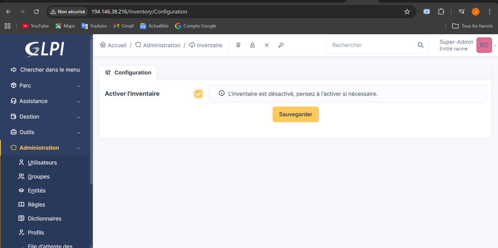

---

## 2. Téléchargement de l'agent GLPI

Télécharger le fichier MSI de l'agent GLPI depuis le site officiel [https://glpi-project.org](https://glpi-project.org).

**Fichier utilisé :** `GLPI-Agent-1.15-x64.msi` (~21,9 Mo)

**Informations du fichier :**

| Propriété | Valeur |
|-----------|--------|
| Nom | GLPI-Agent-1.15-x64 |
| Type | Windows Installer Package (.msi) |
| Taille | 21,9 MB (23 027 712 octets) |
| Emplacement | `C:\Users\Administrator\Downloads` |
| Date de création | 7 avril 2026 |

> 💡 Cocher **Débloquer** dans les propriétés du fichier si Windows affiche un avertissement de sécurité (fichier provenant d'un autre ordinateur).

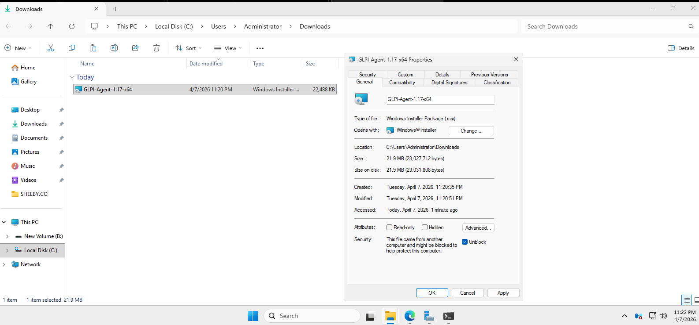

---

## 3. Création du dossier partagé Agent

Un dossier partagé est créé sur le contrôleur de domaine pour héberger le MSI, accessible par tous les postes du domaine.

**Étapes :**
1. Créer un dossier nommé **`Agent`** sur le Bureau (ou dans un emplacement adapté) du DC.
2. Faire un clic droit → **Propriétés** → onglet **Partage** → **Partage avancé**.
3. Cocher **Partager ce dossier**.
4. Définir le nom de partage : **`Agent`**.
5. Cliquer sur **Permissions** pour configurer les droits.

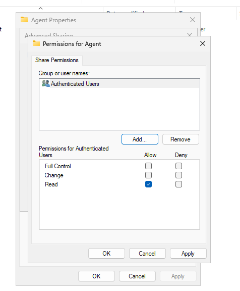

---

## 4. Configuration des permissions du partage

Dans la fenêtre **Permissions for Agent** (Share Permissions) :

| Groupe | Contrôle total | Modifier | Lire |
|--------|:--------------:|:--------:|:----:|
| Authenticated Users | ☐ | ☐ | ✅ |

> La permission **Lecture** suffit pour permettre aux clients du domaine de récupérer le MSI lors du déploiement GPO.

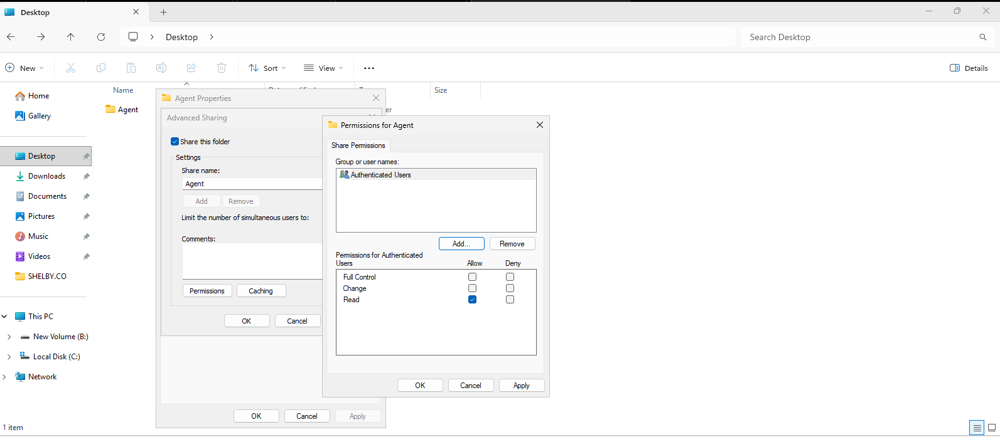

---

## 5. Configuration des permissions NTFS

**Chemin du dossier :** `C:\GAgent`

Dans les propriétés de sécurité NTFS du dossier (onglet **Security**), les permissions sont configurées comme suit :

| Groupe / Utilisateur | Contrôle total | Modifier | Lire & Exécuter | Lister | Lire |
|----------------------|:--------------:|:--------:|:---------------:|:------:|:----:|
| Authenticated Users | ☐ | ☐ | ✅ | ✅ | ✅ |
| SYSTEM | ✅ | ✅ | ✅ | ✅ | ✅ |
| Administrator | ✅ | ✅ | ✅ | ✅ | ✅ |
| Administrators (LAB) | ✅ | ✅ | ✅ | ✅ | ✅ |
| Domain Users (LAB) | ☐ | ☐ | ✅ | ✅ | ✅ |

> Les **Domain Users** ont des droits en lecture/exécution pour accéder au MSI depuis n'importe quel poste du domaine.

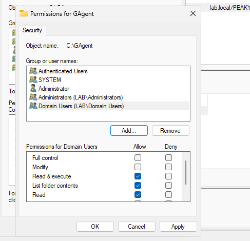

---

## 6. Création de la GPO Agent-Deploy

**Outil :** Group Policy Management Console (GPMC)

La GPO est créée et liée à l'OU **PEAKY-BLINDERS** pour cibler les machines de cette unité organisationnelle.

**Étapes :**
1. Ouvrir la **Group Policy Management Console**.
2. Naviguer vers **Domains** → `lab.local` → **PEAKY-BLINDERS**.
3. Faire un clic droit → **Create a GPO in this domain and Link it here...**.
4. Nommer la GPO : **`Agent-Deploy`**.
5. Cliquer sur **OK**.

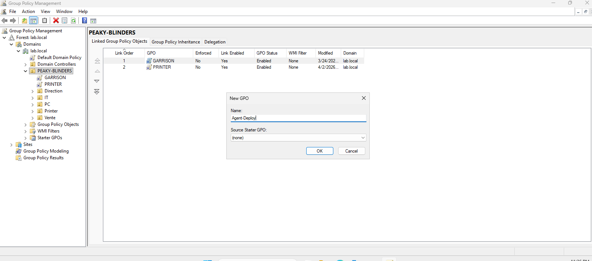

---

## 7. Sélection du paquet MSI via chemin UNC

Dans l'éditeur de GPO, pour ajouter le paquet d'installation, le chemin UNC vers le partage est saisi manuellement.

**Chemin UNC utilisé :** `\\DC25\Agent`

> ⚠️ Il est impératif d'utiliser le **chemin UNC** (`\\serveur\partage`) et non un chemin local, afin que les clients puissent accéder au fichier depuis le réseau.

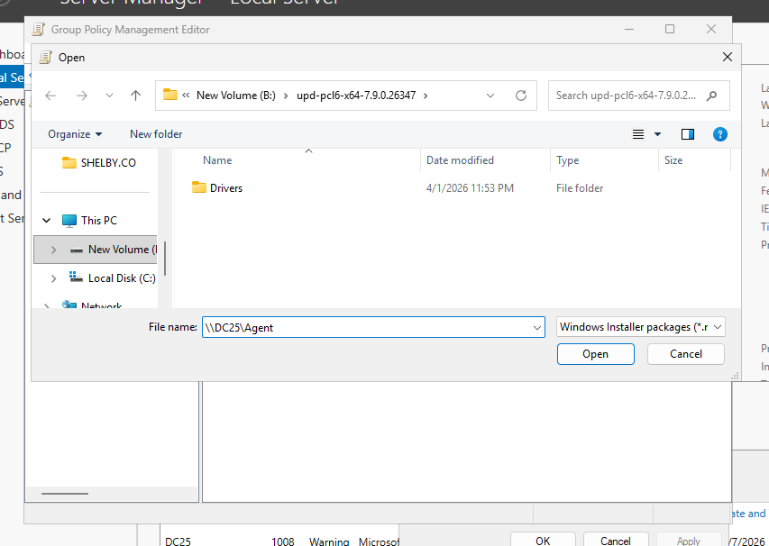

---

## 8. Parcours du partage réseau DC25\Agent

Une fois le chemin UNC saisi, le navigateur de fichiers affiche le contenu du partage `\\DC25\Agent` :

| Fichier | Date | Type | Taille |
|---------|------|------|--------|
| GLPI-Agent-1.17-x64.msi | 4/7/2026 11:20 PM | Windows Installer | 22 488 KB |
| zabbix_agent2-7.4.3-windows-amd64.msi | 4/6/2026 9:47 PM | Windows Installer | 17 368 KB |

Sélectionner **`GLPI-Agent-1.15-x64.msi`** et cliquer sur **Open**.

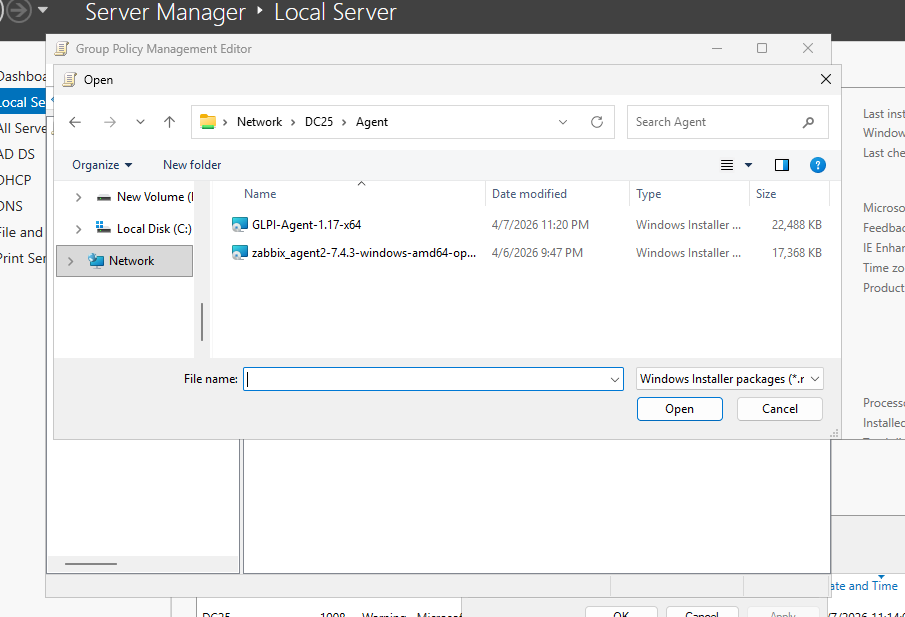

---

## 9. Choix de la méthode de déploiement

Après sélection du MSI, la boîte de dialogue **Deploy Software** propose trois méthodes :

| Méthode | Description |
|---------|-------------|
| **Published** | L'application apparaît dans "Ajout/Suppression de programmes" pour installation manuelle |
| **Assigned** ✅ | L'application est installée automatiquement sans intervention utilisateur |
| **Advanced** | Permet de personnaliser les propriétés avant déploiement |

Sélectionner **Assigned** pour un déploiement silencieux et automatique.

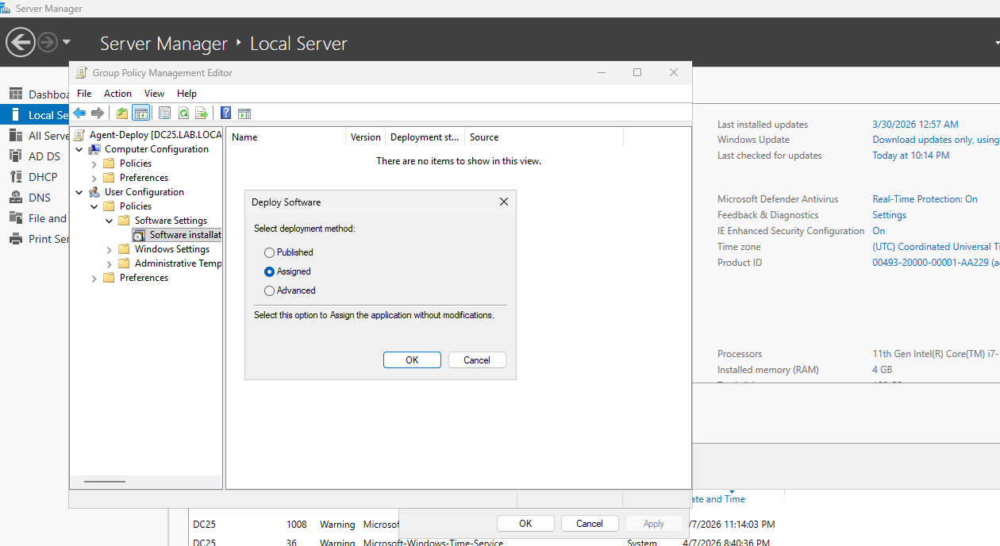

---

## 10. Ajout d'un script de connexion (Logon Script)

En complément du déploiement MSI par GPO, un **script de connexion** est configuré pour s'assurer de l'installation à chaque ouverture de session.

**Chemin GPO :** `User Configuration > Policies > Windows Settings > Scripts (Logon/Logoff)`

**Étapes :**
1. Double-cliquer sur **Logon**.
2. Dans la fenêtre **Logon Properties**, aller dans l'onglet **Scripts**.
3. Cliquer sur **Add...** pour ajouter un nouveau script.

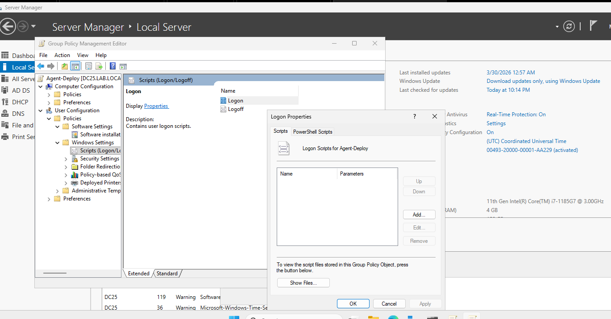

---

## 11. Configuration du script msiexec

Dans la fenêtre **Edit Script**, configurer le script d'installation silencieuse :

| Champ | Valeur |
|-------|--------|
| **Script Name** | `msiexec.exe` |
| **Script Parameters** | `/i "\\DC25\GAgent$\GLPI-Agent-1.15-x64.msi" /quiet RUNNOW=1 SERVER="http://194.146.**.***/" EXECMODE=1` |

**Explication des paramètres :**

- `/i` — installe le paquet MSI spécifié
- `"\\DC25\GAgent$\GLPI-Agent-1.15-x64.msi"` — chemin UNC vers le fichier d'installation (partage caché `GAgent$`)
- `/quiet` — installation silencieuse sans interface utilisateur

> 💡 Le partage `GAgent$` est masqué (suffixe `$`), ce qui le rend invisible dans l'explorateur réseau tout en restant accessible par chemin UNC.

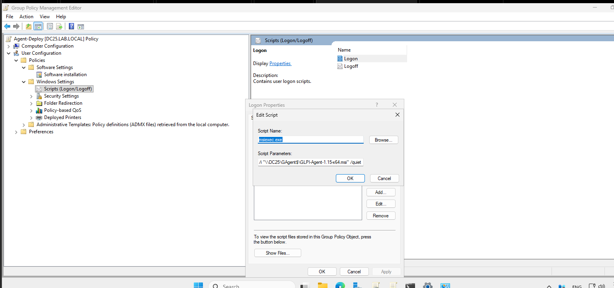

---

## 12. Application de la GPO (gpupdate) — DC25

Sur le **contrôleur de domaine DC25**, forcer l'application des politiques de groupe :

```cmd
gpupdate
```

**Résultat attendu :**

```
Updating policy...

Computer Policy update has completed successfully.
User Policy update has completed successfully.
```

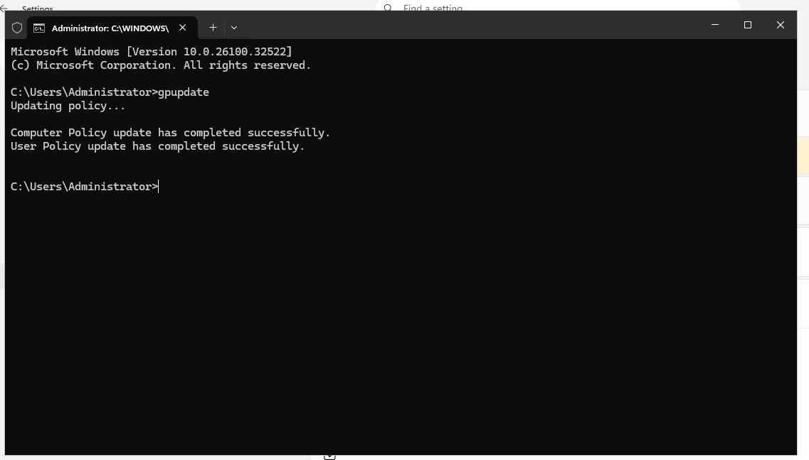

---

## 13. Application de la GPO (gpupdate/force) — Client

Sur un **poste client** du domaine, forcer la mise à jour des politiques :

```cmd
gpupdate /force
```

La commande `/force` réapplique toutes les politiques, même celles déjà appliquées. Cela déclenche l'exécution du script de connexion et l'installation de l'agent GLPI.

> ℹ️ Il peut être nécessaire de **redémarrer la session** ou le poste pour que le Logon Script s'exécute.

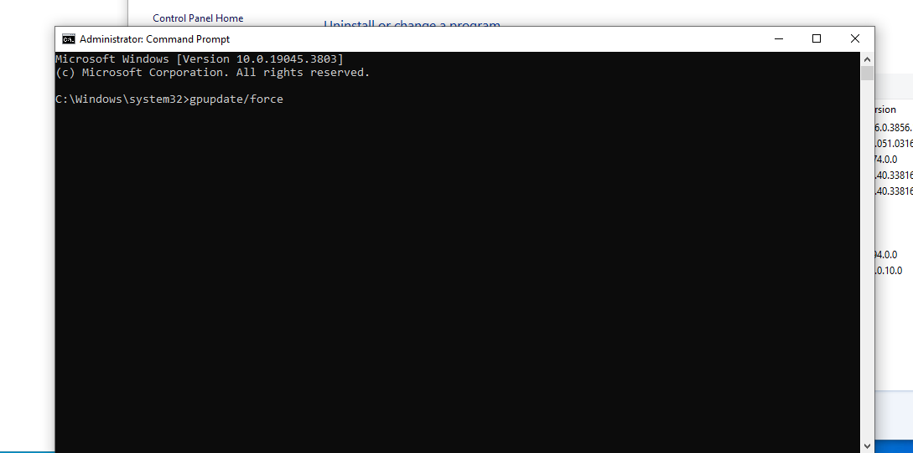

---

## 14. Vérification de l'installation sur le client

**Chemin :** `Panneau de configuration > Programmes > Programmes et fonctionnalités`

Après application de la GPO, vérifier que l'agent GLPI est bien installé sur le poste client :

| Logiciel | Éditeur | Date d'installation | Version |
|----------|---------|---------------------|---------|
| **GLPI Agent 1.15** | Teclib' | 8/4/2026 | 1.15 |
| Zabbix Agent 2 (64-bit) | Zabbix SIA | 7/4/2026 | 7.4.3.2400 |

✅ L'agent GLPI version **1.15** est bien installé (96,5 Mo).

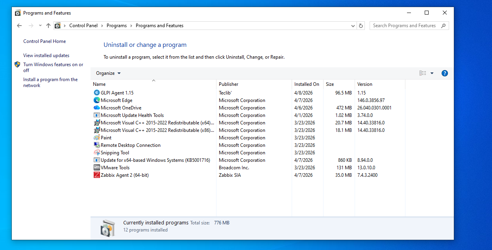

---

## 15. Résultat dans GLPI — Tableau de bord Parc

**Chemin :** `Parc > Tableau de bord`

Le tableau de bord GLPI confirme la remontée de l'inventaire :

| Catégorie | Nombre |
|-----------|--------|
| **Ordinateurs** | **3** |
| Logiciels | 173 |
| Matériel réseau | 0 |
| Moniteur | 0 |
| Licence | 0 |

> 3 machines ont bien remonté leur inventaire vers GLPI, confirmant le bon fonctionnement du déploiement.

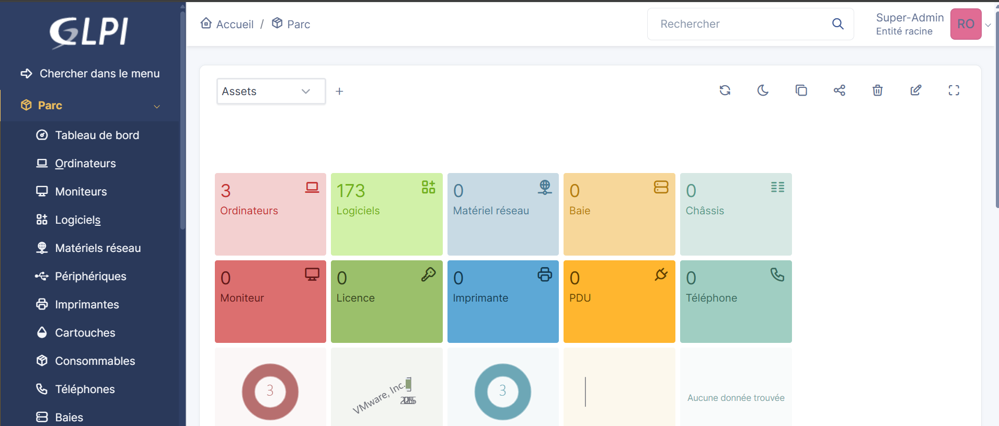

---

## 16. Inventaire des ordinateurs dans GLPI

**Chemin :** `Parc > Ordinateurs`

Les 3 machines inventoriées sont visibles dans GLPI avec leurs métadonnées :

| Nom | Fabricant | Système d'exploitation | Dernière modification | Processeur |
|-----|-----------|------------------------|----------------------|------------|
| **Client-01** | VMware, Inc. | Microsoft Windows 10 Pro | 2026-04-11 01:35 | 11th Gen Intel Core i7-1185G7 @ 3.00GHz |
| **DC25** | VMware, Inc. | Microsoft Windows Server 2025 Standard Evaluation | 2026-04-11 01:32 | 11th Gen Intel Core i7-1185G7 @ 3.00GHz |
| **Client-02** | VMware, Inc. | Microsoft Windows 10 Pro | 2026-04-11 03:32 | 11th Gen Intel Core i7-1185G7 @ 3.00GHz |

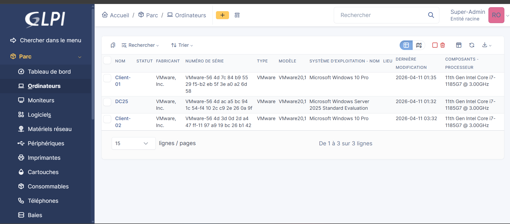

---

## 17. Détail des logiciels inventoriés

**Chemin :** `Parc > Ordinateurs > [machine] > Logiciels`

Pour chaque ordinateur, GLPI liste l'ensemble des logiciels installés avec leur version, date d'installation et architecture. Exemple sur un poste client :

- **166 logiciels** détectés
- Inventaire automatique : **Oui** pour tous les logiciels détectés par l'agent
- 1 antivirus détecté
- 24 composants matériels remontés
- 4 volumes disques remontés

Exemples de logiciels inventoriés :

| Nom | Version | Date d'installation | Architecture |
|-----|---------|---------------------|--------------|
| 64 Bit HP CIO Components Installer | 22.2.1 | 2026-04-02 | x86_64 |
| Add Folder Suggestions dialog | 10.0.19041.3636 | 2019-12-07 | neutral |

> L'inventaire automatique complet (logiciels, matériel, antivirus, réseau) est opérationnel sur toutes les machines du domaine.

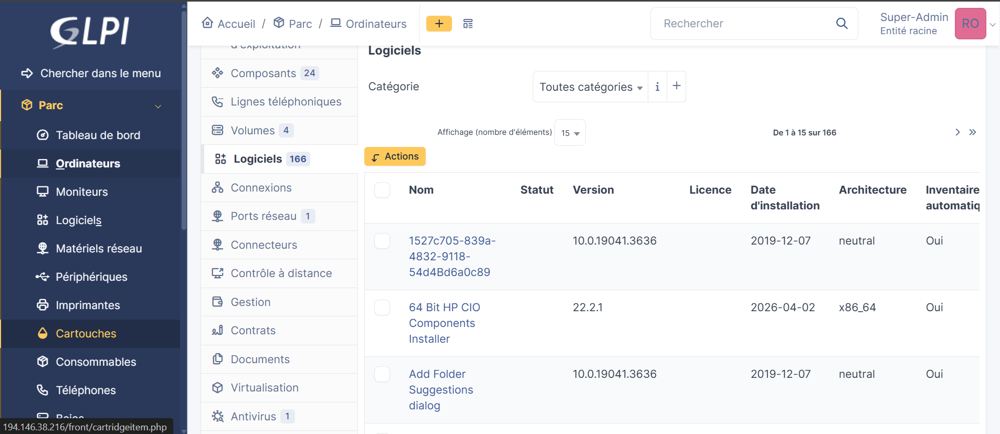

---
