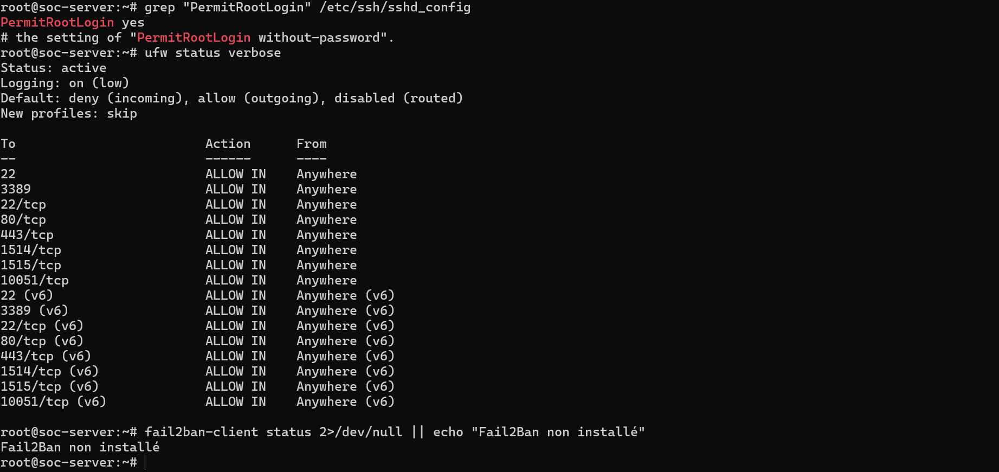
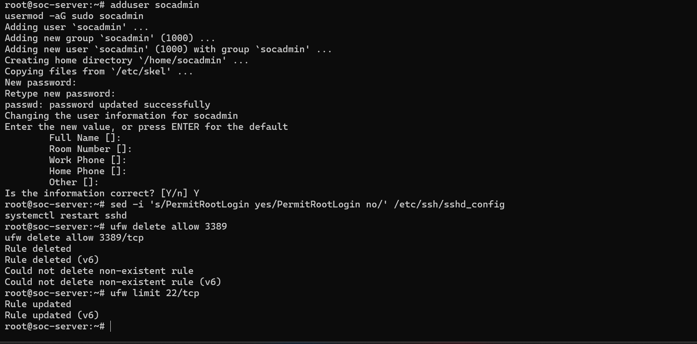
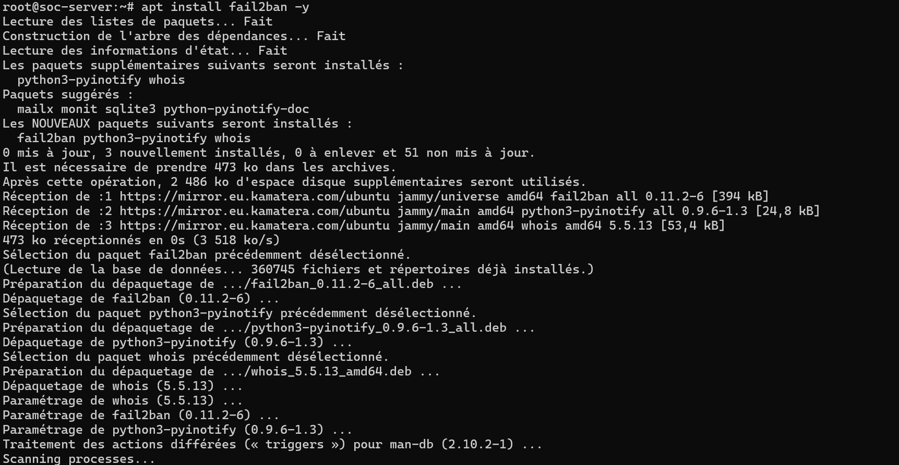
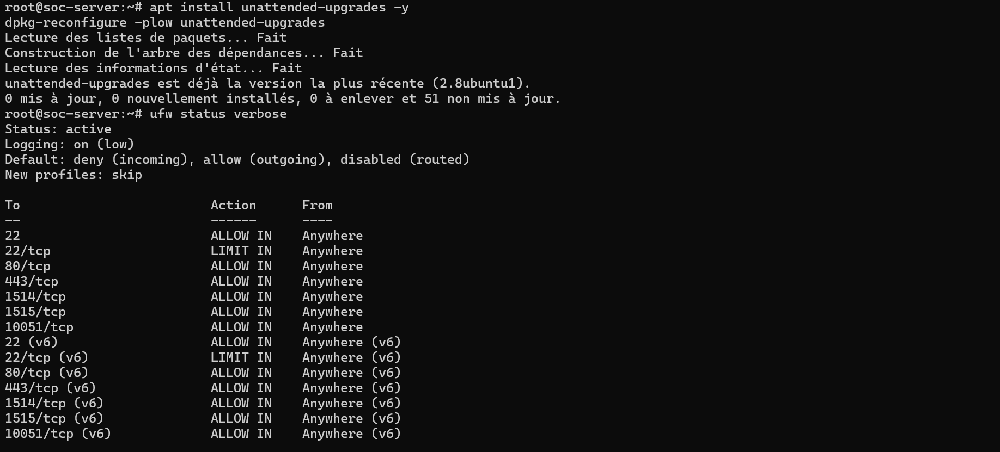
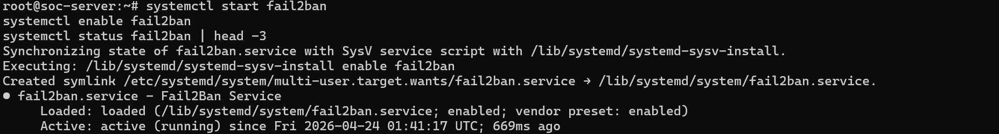
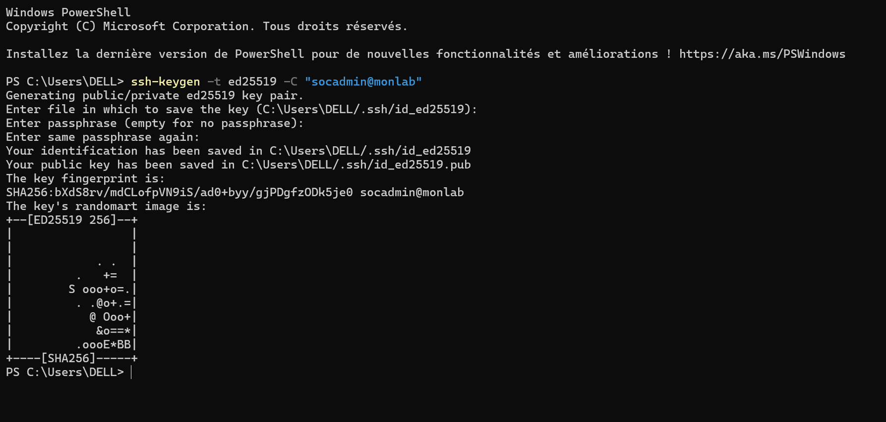
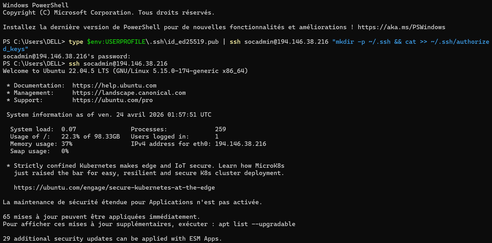
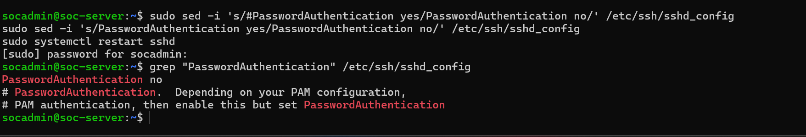
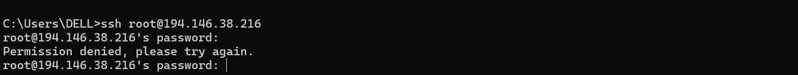

# 🔒 Durcissement du VPS (soc-server)

> Documentation des étapes de sécurisation du serveur VPS Ubuntu 22.04 LTS hébergeant la stack de supervision (Zabbix, Wazuh, GLPI).

---


## 1. Audit initial — SSH & Pare-feu

Avant toute modification, on réalise un audit de l'état initial du serveur : vérification de la configuration SSH et des règles UFW.



**Constats :**
- `PermitRootLogin yes` → la connexion SSH en root est **activée** ⚠️
- Le port `3389` (RDP) est ouvert inutilement ⚠️
- `Fail2Ban` n'est pas installé ⚠️
- Les ports nécessaires sont ouverts : `22`, `80/tcp`, `443/tcp`, `1514/tcp`, `1515/tcp`, `10051/tcp`

---

## 2. Création d'un utilisateur non-root & Sécurisation SSH

Création d'un utilisateur dédié `socadmin` avec droits sudo, désactivation du login root SSH, suppression du port RDP et limitation des tentatives SSH.



```bash
# Créer l'utilisateur socadmin
adduser socadmin
usermod -aG sudo socadmin

# Désactiver le login root via SSH
sed -i 's/PermitRootLogin yes/PermitRootLogin no/' /etc/ssh/sshd_config
systemctl restart sshd

# Supprimer la règle RDP inutile
ufw delete allow 3389
ufw delete allow 3389/tcp

# Limiter les tentatives SSH (anti brute-force)
ufw limit 22/tcp
```

**Résultat :** Le port RDP est fermé, le root SSH est désactivé et le port 22 est en mode `LIMIT`.

---

## 3. Installation de Fail2Ban

Installation de Fail2Ban pour protéger le serveur contre les attaques par force brute.



```bash
apt install fail2ban -y
```

**Paquets installés :**
- `fail2ban` (0.11.2-6)
- `python3-pyinotify` (0.9.6-1.3)
- `whois` (5.5.13)

---

## 4. Mises à jour automatiques & Vérification UFW

Installation des mises à jour de sécurité automatiques et vérification de l'état final du pare-feu.



```bash
apt install unattended-upgrades -y
dpkg-reconfigure -plow unattended-upgrades
```

**État UFW après durcissement :**

| Port | Action | Remarque |
|------|---------|----------|
| 22 | ALLOW IN | SSH |
| 22/tcp | **LIMIT IN** | Anti brute-force ✅ |
| 80/tcp | ALLOW IN | HTTP |
| 443/tcp | ALLOW IN | HTTPS |
| 1514/tcp | ALLOW IN | Wazuh |
| 1515/tcp | ALLOW IN | Wazuh |
| 10051/tcp | ALLOW IN | Zabbix |

> Le port `3389` (RDP) a bien été supprimé ✅

---

## 5. Démarrage et activation de Fail2Ban

Démarrage du service Fail2Ban, activation au démarrage et vérification du statut.



```bash
systemctl start fail2ban
systemctl enable fail2ban
systemctl status fail2ban | head -3
```

**Résultat :** Fail2Ban est **actif et en cours d'exécution** depuis le `2026-04-24 01:41:17 UTC` ✅

---

## 6. Génération de clé SSH côté client

Depuis le poste Windows (PowerShell), génération d'une paire de clés SSH ED25519 pour une authentification sans mot de passe.



```powershell
ssh-keygen -t ed25519 -C "socadmin@monlab"
```

**Résultat :**
- Clé privée : `C:\Users\DELL\.ssh\id_ed25519`
- Clé publique : `C:\Users\DELL\.ssh\id_ed25519.pub`
- Algorithme : **ED25519** (plus sécurisé que RSA) ✅

---

## 7. Déploiement de la clé publique & Connexion SSH par clé

Copie de la clé publique sur le serveur et première connexion SSH par clé sans mot de passe.



```powershell
# Copier la clé publique sur le serveur
type $env:USERPROFILE\.ssh\id_ed25519.pub | ssh socadmin@194.146.38.216 "mkdir -p ~/.ssh && cat >> ~/.ssh/authorized_keys"

# Se connecter via clé SSH
ssh socadmin@194.146.38.216
```

**Résultat :** Connexion réussie en tant que `socadmin` sur **Ubuntu 22.04.5 LTS** sans mot de passe ✅

---

## 8. Désactivation de l'authentification par mot de passe

Dernière étape critique : désactivation totale de l'authentification par mot de passe SSH pour forcer l'usage des clés.



```bash
sudo sed -i 's/#PasswordAuthentication yes/PasswordAuthentication no/' /etc/ssh/sshd_config
sudo sed -i 's/PasswordAuthentication yes/PasswordAuthentication no/' /etc/ssh/sshd_config
sudo systemctl restart sshd

# Vérification
grep "PasswordAuthentication" /etc/ssh/sshd_config
```

**Résultat :** `PasswordAuthentication no` ✅ — Seules les clés SSH sont acceptées désormais.

---

## 9. Vérification — Blocage de la connexion root

Test final : tentative de connexion SSH en root → accès refusé, confirmant que le durcissement est effectif.



```bash
ssh root@194.146.38.216
# → Permission denied, please try again.
```

**Résultat :** La connexion root est bien **bloquée** ✅

---
