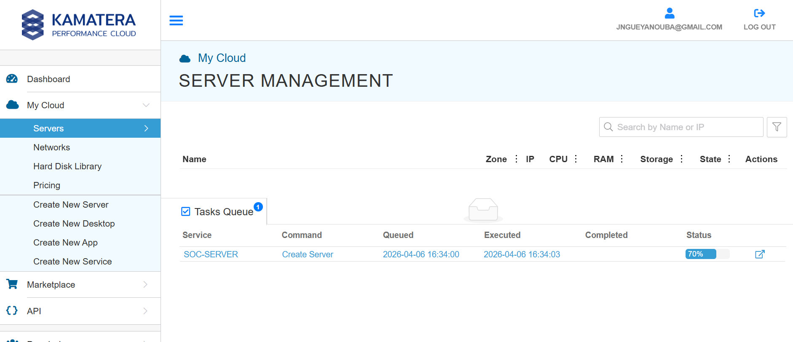
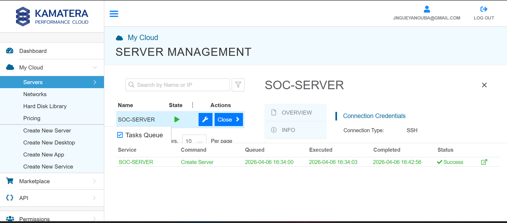
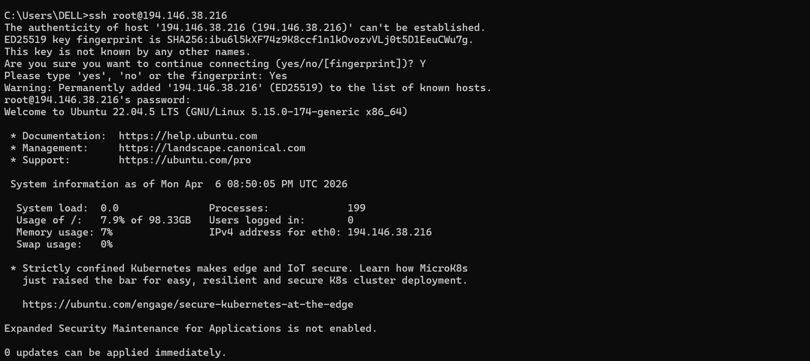
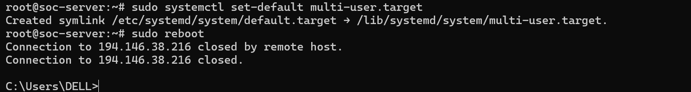
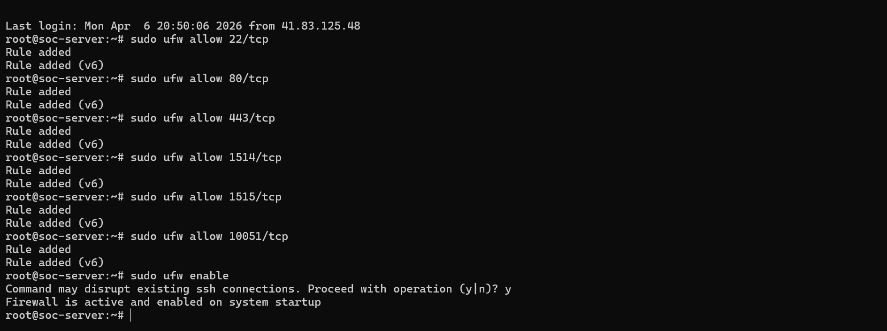

# 🖥️ Configuration du Serveur SOC — VPS Kamatera Ubuntu 22.04

> **Environnement :** Kamatera Performance Cloud — Ubuntu 22.04.5 LTS — Serveur `SOC-SERVER`  
> **Objectif :** Déployer et préparer un VPS cloud sur Kamatera servant de base à un SOC (Security Operations Center) destiné à accueillir les services **Zabbix**, **GLPI** et **Wazuh**

---

## Partie A — Provisionnement du VPS sur Kamatera

### 1. Création du serveur SOC-SERVER — Tasks Queue en cours

**Accès :** Kamatera Console → My Cloud → **Servers** → Create New Server

Après soumission de la commande de création, la **Tasks Queue** affiche la tâche en cours :

| Champ | Valeur |
|-------|--------|
| **Service** | `SOC-SERVER` |
| **Command** | `Create Server` |
| **Queued** | `**********` |
| **Executed** | `********` |
| **Status** | `70%` *(provisionnement en cours)* |

> La tâche passe à l'état **Executed** seulement 3 secondes après avoir été mise en **Queue** — Kamatera démarre le provisionnement quasi instantanément. La barre de progression à **70%** indique que le disque et le système d'exploitation sont en cours d'installation sur le nœud cloud.



---

### 2. Finalisation de la création — Statut Success

Une fois le provisionnement terminé, le serveur `SOC-SERVER` apparaît dans la liste **Server Management** avec l'état **Running** (indicateur vert) :

| Champ | Valeur |
|-------|--------|
| **Service** | `SOC-SERVER` |
| **Command** | `Create Server` |
| **Queued** | `**********` |
| **Executed** | `**********` |
| **Completed** | `**********` |
| **Status** | ✅ `Success` |
| **Connection Type** | `SSH` |

> La création du serveur a pris environ **8 minutes 53 secondes** entre la mise en queue et la complétion. Le panneau latéral **Connection Credentials** confirme que le type d'accès est **SSH** — les identifiants (IP, login, mot de passe) y sont disponibles pour la première connexion.



---

## Partie B — Connexion SSH & Premier accès

### 3. Connexion SSH initiale depuis Windows — Vérification de l'empreinte

**Commande exécutée depuis le poste Windows :**

```
ssh root@194.146.**.**
```

Lors de la première connexion, SSH demande de valider l'empreinte du serveur :

| Paramètre | Valeur |
|-----------|--------|
| **Hôte** | `194.146.**.**` |
| **Algorithme de clé** | `ED****` |
| **Fingerprint SHA256** | `ibu6l5k****************` |
| **Réponse saisie** | `Yes` |
| **Résultat** | Clé ajoutée aux `******` |

**Informations système affichées à la connexion :**

| Métrique | Valeur |
|----------|--------|
| **OS** | Ubuntu 22.04.5 LTS (GNU/Linux 5.15.0-174-generic x86_64) |
| **System load** | 0.0 |
| **Usage disque** | 7.9% de 98.33 GB |
| **Memory usage** | 7% |
| **Swap usage** | 0% |
| **Processes** | 199 |
| **IPv4 (eth0)** | `194.146.**.**` |

> L'empreinte **ED25519** doit être vérifiée manuellement via la console Kamatera avant d'accepter — c'est la protection contre une attaque **Man-in-the-Middle** lors du premier accès. Une fois validée, la clé est stockée dans `C:\Users\DELL\.ssh\known_hosts` et ne sera plus demandée.



---

## Partie C — Configuration système de base

### 4. Passage en mode multi-user et redémarrage du serveur

**Commandes exécutées :**

```bash
sudo systemctl set-default multi-user.target
sudo reboot
```

| Étape | Résultat |
|-------|----------|
| `set-default multi-user.target` | Création du symlink `/etc/systemd/system/default.target` → `/lib/systemd/system/multi-user.target` |
| `sudo reboot` | Connexion fermée par l'hôte distant |

> Le **multi-user.target** est l'équivalent du runlevel 3 sous systemd — il démarre tous les services réseau et système **sans interface graphique**. C'est le mode optimal pour un serveur SOC : il libère les ressources CPU/RAM habituellement consommées par un environnement de bureau, cruciales pour des services comme **Wazuh** ou **Zabbix** qui sont gourmands en ressources.



---

### 5. Configuration du pare-feu UFW — Ouverture des ports SOC

Après redémarrage, configuration du pare-feu **UFW** avec les ports nécessaires aux services SOC :

**Commandes exécutées :**

```bash
sudo ufw allow 22/tcp
sudo ufw allow 80/tcp
sudo ufw allow 443/tcp
sudo ufw allow 1514/tcp
sudo ufw allow 1515/tcp
sudo ufw allow 10051/tcp
sudo ufw enable
```

| Port | Protocole | Service associé | Statut |
|------|-----------|-----------------|--------|
| `22` | TCP | SSH — Administration distante | ✅ Rule added |
| `80` | TCP | HTTP — Interfaces web (GLPI, Zabbix) | ✅ Rule added |
| `443` | TCP | HTTPS — Accès sécurisé | ✅ Rule added |
| `1514` | TCP | **Wazuh** — Réception des agents (log collection) | ✅ Rule added |
| `1515` | TCP | **Wazuh** — Enregistrement des agents | ✅ Rule added |
| `10051` | TCP | **Zabbix** — Réception des trappers/agents actifs | ✅ Rule added |

> Chaque règle est automatiquement créée en **IPv4 et IPv6** (`Rule added` + `Rule added (v6)`). L'activation de l'UFW avec `ufw enable` a nécessité une confirmation (`y`) car elle peut interrompre les connexions SSH actives — le port 22 ayant été autorisé en amont, la session reste maintenue. UFW est désormais **actif et persistant au démarrage**.



---

## Récapitulatif de la configuration

### Infrastructure VPS

| Composant | Valeur |
|-----------|--------|
| **Fournisseur** | Kamatera Performance Cloud |
| **Nom du serveur** | `SOC-SERVER` |
| **Système d'exploitation** | Ubuntu 22.04.5 LTS |
| **Kernel** | GNU/Linux 5.15.0-174-generic x86_64 |
| **IP publique** | `194.146.**.**` |
| **Stockage** | 98.33 GB |
| **Accès** | SSH (root) |

### Ports ouverts (UFW)

| Port | Usage |
|------|-------|
| `22/tcp` | SSH |
| `80/tcp` | HTTP |
| `443/tcp` | HTTPS |
| `1514/tcp` | Wazuh Agent Communication |
| `1515/tcp` | Wazuh Agent Enrollment |
| `10051/tcp` | Zabbix Active Agent / Trapper |

### Services SOC prévus

| Service | Rôle |
|---------|------|
| **Wazuh** | SIEM & XDR — Corrélation d'événements de sécurité |
| **Zabbix** | Supervision réseau & système |
| **GLPI** | Gestion de parc & tickets ITSM |

---

## Remarques

- Les captures sont issues d'un environnement cloud réel sur **Kamatera Performance Cloud**.
- Le mode **multi-user.target** est recommandé pour tous les serveurs de production Linux sans interface graphique — il optimise les ressources pour les services métier.
- Le port **10051/tcp** (Zabbix agent actif) pourra être ajouté ultérieurement si des agents passifs sont configurés.
- Il est recommandé de **désactiver l'authentification par mot de passe SSH** et de basculer sur une authentification par **clé publique** avant la mise en production des services SOC.
- Les ports **1514** et **1515** sont spécifiques à **Wazuh Manager** — ils devront être accessibles depuis tous les hôtes sur lesquels un agent Wazuh sera déployé.

---

