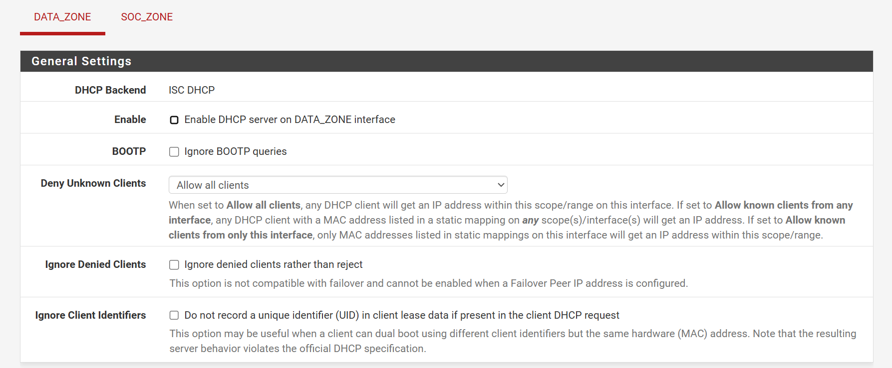
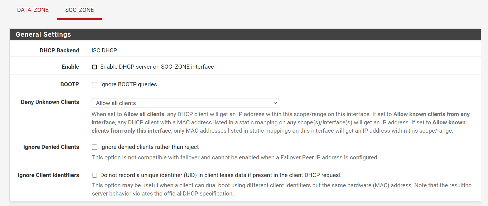
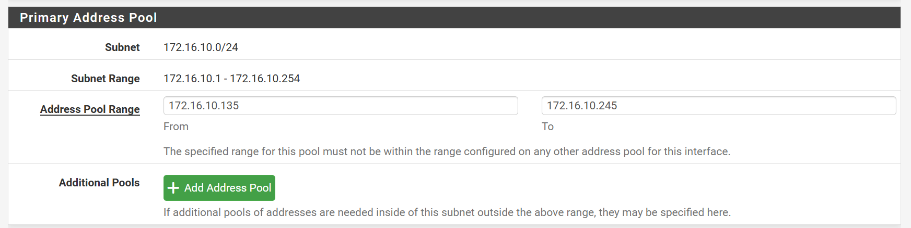
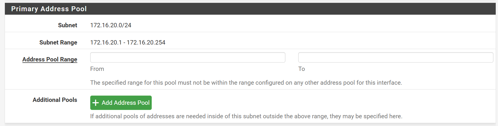
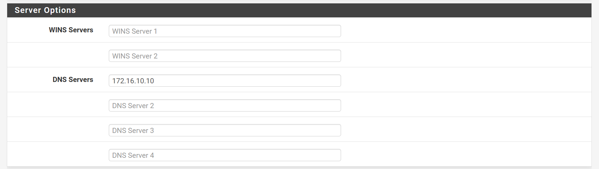
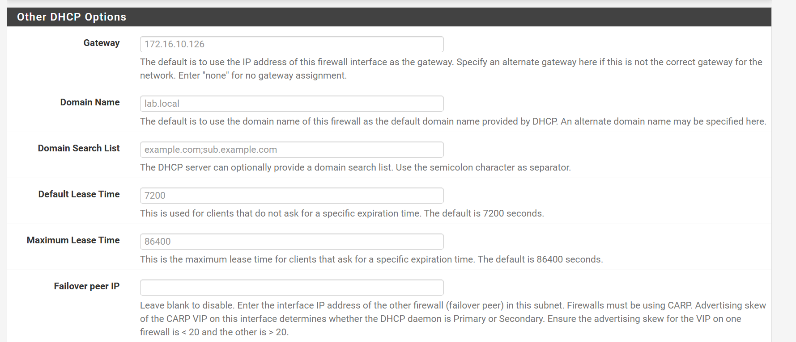
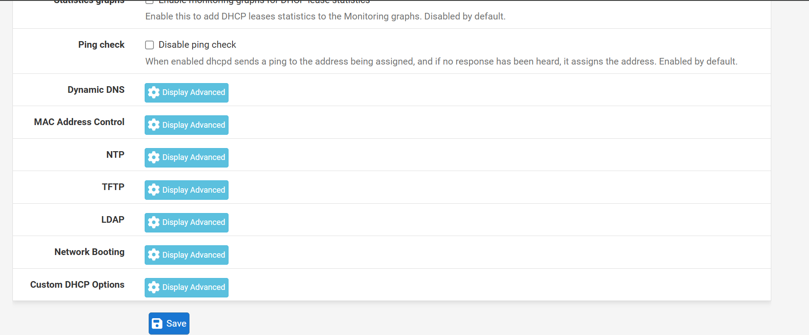

# 🔑 Centralisation DHCP (Relay)

Dans le cadre du durcissement de l'infrastructure, l'attribution des adresses IP a été centralisée sur le **Windows Server (DC25)**. Cette approche permet de corréler directement les baux DHCP avec les journaux d'audit de l'Active Directory.

## ⚙️ Configuration du DHCP Relay
Pour permettre cette centralisation tout en maintenant la segmentation réseau, pfSense a été configuré comme agent de relais.

### 1. Désactivation du serveur DHCP local
Afin d'éviter tout conflit d'adressage (Rogue DHCP) et de laisser la main au DC25, le service DHCP natif de pfSense a été explicitement désactivé sur les interfaces métiers.

* **Segment DATA** : Désactivation du serveur local.

* **Segment SOC** : Désactivation du serveur local.

### 2. Paramétrage de l'Agent de Relais
Le relais intercepte les requêtes `DHCP Discover` (broadcast) provenant des zones clients et les encapsule dans un paquet `Unicast` à destination du serveur cible.

* **Serveur DHCP Cible** : `172.16.10.10` (Contrôleur de domaine DC25).
* **Interfaces actives** : `DATA_ZONE` et `SOC_ZONE`.

## 📋 Étendues et Options distribuées
Le serveur DHCP fournit une configuration complète permettant aux machines de s'intégrer nativement à l'infrastructure.

### 1. Pool d'adresses (Scope)
L'étendue configurée sur le serveur Windows respecte les limites suivantes pour garantir la disponibilité d'adresses statiques :
* **Plage de distribution** : `172.16.10.135` à `172.16.10.245`.

* **Sous-réseau** : `172.16.10.0/24`.

* **Plage de distribution** : `172.16.20.135` à `172.16.20.245`.

* **Sous-réseau** : `172.16.20.0/24`.

### 2. Options de Portée (Scope Options)
Le serveur transmet également les paramètres indispensables à la résolution de noms interne :
* **DNS Primaire** : `172.16.10.10` (Contrôleur de domaine).

le DNS rest pareil pour les deux segments c'est à dire pour le segment DATA_ZONE et le segment SOC_ZONE.
* **Suffixe DNS** : `lab.local`.
* **Passerelle** : `172.16.10.126` (Interface pfSense).

## 🛡️ Justification Sécurité (SSI)
* **Réduction de la surface d'attaque** : Les fonctionnalités avancées telles que le **OMAPI** ou le **Network Booting** sont laissées non configurées pour prévenir les vecteurs d'attaque au démarrage.

* **Auditabilité** : La centralisation permet de suivre l'historique complet des attributions d'adresses depuis une console unique, facilitant ainsi les investigations numériques (Forensics).