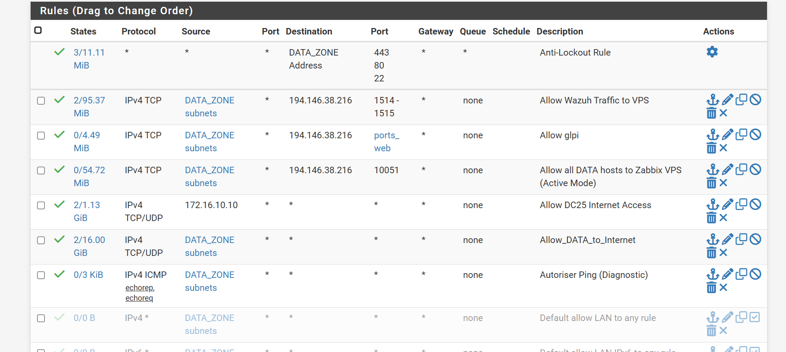
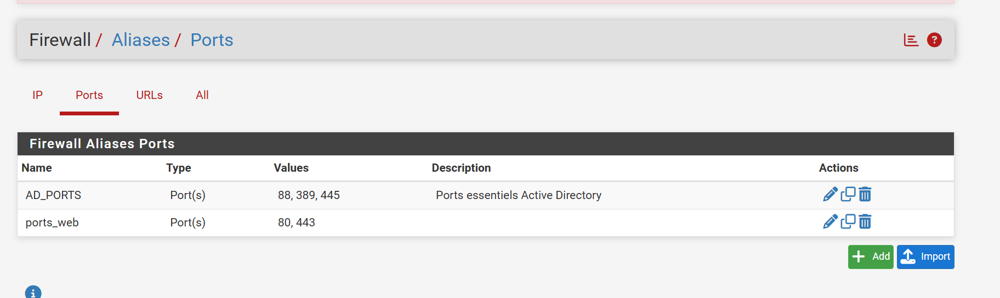

# 🛡️ Politique de Filtrage et Durcissement (Firewall Rules)

L'infrastructure réseau repose sur une politique de **Default Deny**. Par défaut, tout trafic inter-zone est bloqué par le pare-feu pfSense. Seuls les flux critiques nécessaires aux services d'annuaire (AD), à l'accès applicatif (GLPI), à la supervision (Zabbix/Wazuh) et au diagnostic réseau sont explicitement autorisés.

## ⚖️ Philosophie de Sécurité
Nous appliquons le principe du **moindre privilège** :
* **Isolation stricte** : Seuls les flux explicitement définis sont autorisés vers l'extérieur ou les services internes.
* **Filtrage État (Stateful)** : Le pare-feu autorise automatiquement le trafic retour pour les connexions établies.
* **Priorisation du Diagnostic** : Les règles ICMP (Ping) sont autorisées et journalisées pour faciliter la maintenance.

---

## 📋 Matrice des Flux : DATA_ZONE (Sortant)
*Contrôle des communications depuis le parc Windows/Clients.*

| Action | Protocole | Source | Port | Destination | Description |
| :--- | :--- | :--- | :--- | :--- | :--- |
| **PASS** | * | * | 443, 80, 22 | `DATA_ZONE Address` | **Anti-Lockout** : Accès à l'administration pfSense. |
| **PASS** | TCP | `DATA_ZONE subnets` | `ports_web` | `194.146.xx.xx` | **GLPI** : Accès à la gestion de parc (VPS). |
| **PASS** | TCP | `DATA_ZONE subnets` | 1514-1515 | `194.146.xx.xx` | **Wazuh Agents** : Flux SIEM vers le serveur ITSM (VPS). |
| **PASS** | TCP | `DATA_ZONE subnets` | 10051 | `194.146.xx.xx` | **Zabbix Trapper** : Envoi des métriques vers le VPS. |
| **PASS** | TCP/UDP | `172.16.10.10` | * | Any | **DC25 Internet** : Accès Internet pour le contrôleur de domaine. |
| **PASS** | TCP/UDP | `DATA_ZONE subnets` | * | Any | **Internet** : Accès général pour le segment DATA. |
| **PASS** | ICMP | `DATA_ZONE subnets` | * | Any | **Ping** : Diagnostic réseau (Echorep, Echoreq). |

> **Note de durcissement** : Les règles "Default allow" d'usine ont été remplacées par des règles spécifiques et journalisées.

---

## ⚙️ Implémentation technique

### 1. Optimisation via les Alias
Un alias nommé **`AD_PORTS`** a été configuré pour regrouper les ports essentiels de l'Active Directory, assurant une meilleure lisibilité de la matrice de flux :
* **Ports inclus** : 88 (Kerberos), 389 (LDAP), 445 (SMB).

### 2. Sécurité Périmétrale (Interface WAN)
L'interface WAN est configurée pour rejeter systématiquement le trafic provenant d'adresses non routables sur l'Internet public afin de prévenir l'IP Spoofing.

* **Block RFC1918** : Bloque les plages privées (10/8, 172.16/12, 192.168/16).
* **Block Bogon Networks** : Bloque les réseaux non attribués par l'IANA.

> *Note : Dans ce lab, ces options sont décochées car le WAN du pfSense est lui-même sur un segment privé de l'hyperviseur.*

---

* **Journalisation (Logging)** : L'option "Log" est activée sur chaque règle métier pour assurer une visibilité complète sur les flux réseau.
* **Anti-Lockout** : Une règle spécifique protège l'accès à l'interface d'administration (80/443/22) pour éviter toute perte de contrôle du pare-feu depuis le segment d'administration.
