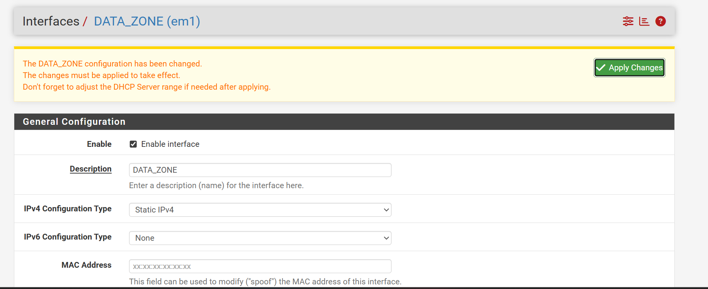
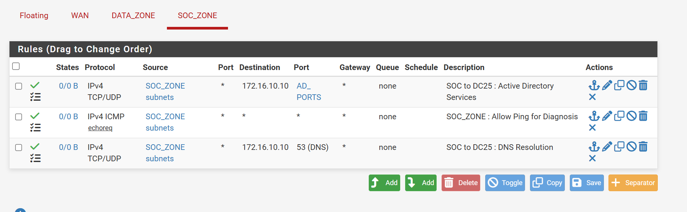
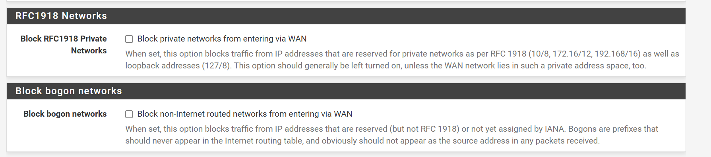

# 🛡️ Politique de Filtrage et Durcissement (Firewall Rules)

L'infrastructure réseau repose sur une politique de **Default Deny**. Par défaut, tout trafic inter-zone est bloqué par le pare-feu pfSense. Seuls les flux critiques nécessaires à la supervision (SOC), aux services d'annuaire (AD) et au diagnostic réseau sont explicitement autorisés.

## ⚖️ Philosophie de Sécurité
Nous appliquons le principe du **moindre privilège** :
* **Isolation stricte** : Les segments `DATA_ZONE` et `SOC_ZONE` ne communiquent que via des ports spécifiques.
* **Filtrage État (Stateful)** : Le pare-feu autorise automatiquement le trafic retour pour les connexions établies.
* **Priorisation** : Les règles de diagnostic (ICMP) sont journalisées pour détecter toute tentative de reconnaissance (network scanning).

---

## 📋 Matrice des Flux : DATA_ZONE (Sortant)
*Contrôle des communications depuis le parc Windows/Clients vers le SOC.*

| Action | Protocole | Source | Port | Destination | Description |
| :--- | :--- | :--- | :--- | :--- | :--- |
| **PASS** | TCP | `DATA_ZONE` | 10051 | `172.16.20.100` | **Zabbix Trapper** : Envoi des métriques. |
| **PASS** | ICMP | `DATA_ZONE` | Echo Req | Any | **Ping** : Diagnostic réseau autorisé. |
| **PASS** | TCP | `DATA_ZONE` | 1514-1515 | `172.16.20.100` | **Wazuh** : Logs (1514) et Enrollment (1515). |

## 📋 Matrice des Flux : SOC_ZONE (Sortant)
*Contrôle des communications depuis les serveurs de supervision vers l'infrastructure et l'extérieur.*

| Action | Protocole | Source | Port | Destination | Description |
| :--- | :--- | :--- | :--- | :--- | :--- |
| **PASS** | TCP/UDP | `SOC_ZONE` | `AD_PORTS` | `172.16.10.10` | **Services AD** : Kerberos, LDAP, SMB via Alias. |
| **PASS** | ICMP | `SOC_ZONE` | Echo Req | Any | **Ping** : Diagnostic réseau autorisé. |
| **PASS** | TCP/UDP | `SOC_ZONE` | 53 (DNS) | `172.16.10.10` | **DNS** : Résolution de noms via le DC25. |
| **PASS** | TCP | `SOC_ZONE` | 443 | Any | **Updates** : Mises à jour des signatures (WAN). |

---

## ⚙️ Implémentation technique

L'application des règles suit l'ordre de traitement **Top-Down**. Pour chaque zone, les accès génériques ont été révoqués au profit d'ouvertures granulaires avec journalisation active.

### 1. Durcissement de la DATA_ZONE
Le verrouillage est confirmé par la désactivation des règles "Default allow" d'usine (grisées sur l'interface). Tout flux non répertorié est automatiquement rejeté.

### 2. Optimisation de la SOC_ZONE via Aliases
Pour la `SOC_ZONE`, un alias nommé `AD_PORTS` regroupe les flux Kerberos, LDAP et SMB vers le contrôleur de domaine (`172.16.10.10`). Cette méthode assure une meilleure lisibilité de la politique de sécurité.

### 3. Stratégie de Journalisation (Logging)
L'option **Log** est activée sur chaque règle métier. Cette visibilité est essentielle pour :
* **L'auditabilité** : Traçabilité des flux critiques.
* **Le SOC** : Alimentation du SIEM pour la détection d'anomalies réseau.

## 🛡️ Protection de l'interface WAN (Périmètre)

En complément des règles de filtrage interne, des mesures de sécurité ont été appliquées sur l'interface WAN pour protéger l'infrastructure contre les menaces externes courantes.

### 1. Blocage des réseaux privés et non routables
L'interface WAN est configurée pour rejeter systématiquement le trafic provenant d'adresses qui ne devraient pas exister sur l'Internet public.

* **Block RFC1918 Private Networks** : Cette option bloque les adresses privées (ex: 10.0.0.0/8, 172.16.0.0/12, 192.168.0.0/16) d'entrer via le WAN. Cela empêche les attaques de type *spoofing* où un attaquant externe tenterait d'utiliser une IP interne pour contourner le filtrage.
* **Block Bogon Networks** : Bloque les réseaux non attribués par l'IANA ou réservés.

> *Note : Dans le cadre de ce lab, ces options sont décochées sur la capture (voir `block.png`) car le pfSense est lui-même derrière un hyperviseur utilisant un adressage privé pour le WAN. En environnement de production réel, ces cases doivent impérativement être cochées.*

---

## 🧪 Tests de Validation (QA)
1. **Flux Métier** : Confirmation de la remontée des agents Wazuh et Zabbix vers le manager.
2. **Authentification** : Validation de la résolution DNS et de la communication AD depuis le SOC vers le DC25.
3. **Étanchéité** : Vérification du blocage des flux non autorisés (ex: navigation Web depuis la DATA_ZONE).

> **Note :** L'accès à l'interface de gestion (WebGUI) est protégé par HTTPS et restreint via la règle "Anti-Lockout" sur le segment d'administration.