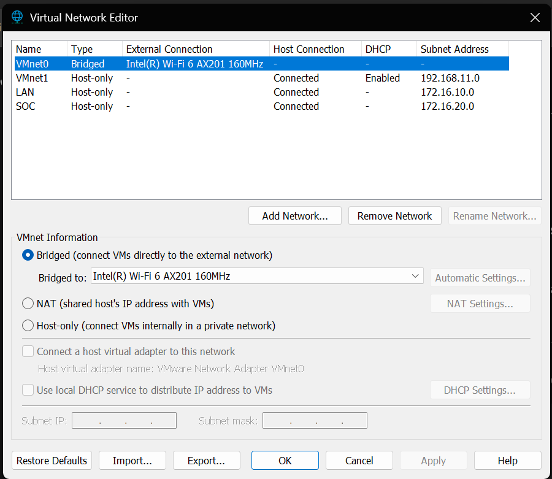
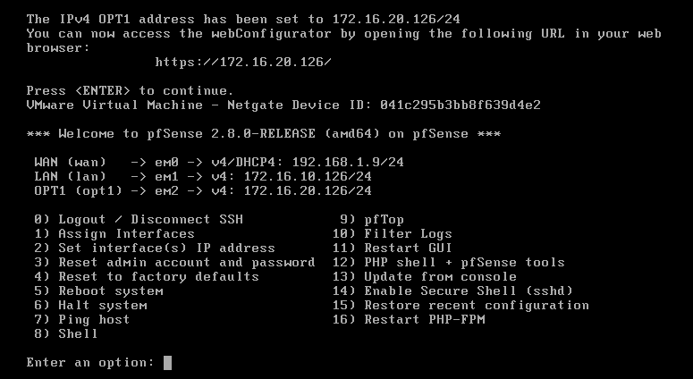
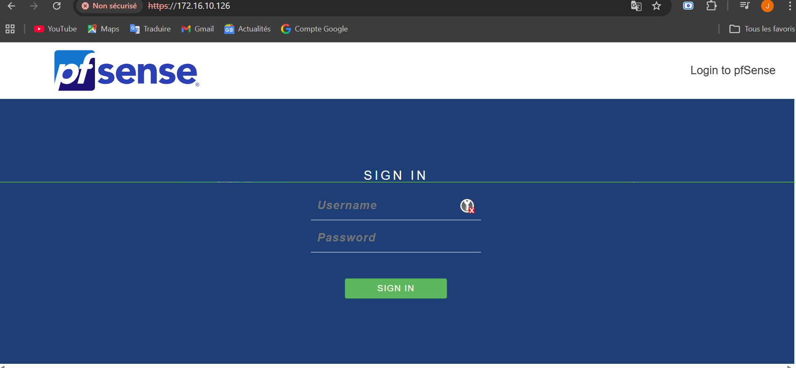
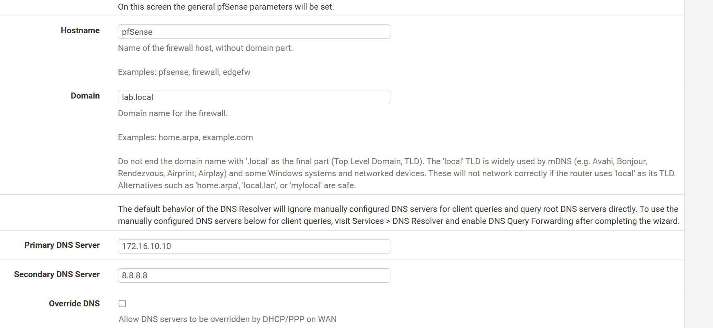
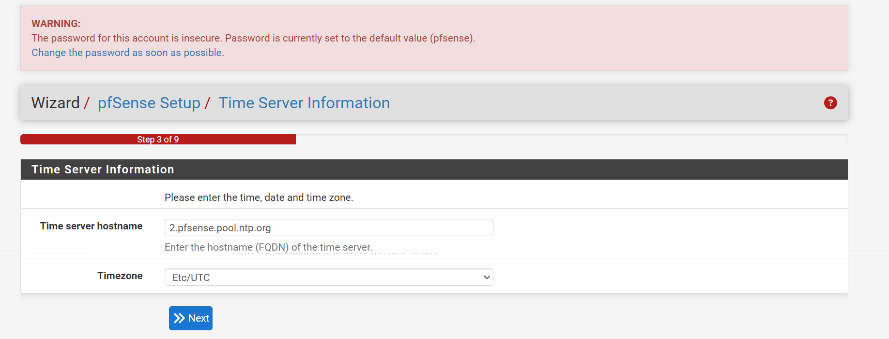

# 🌐 Configuration des Interfaces pfSense

L'infrastructure réseau de ce projet est segmentée en deux zones distinctes. Cette architecture permet d'appliquer le principe de **défense en profondeur** en isolant les flux critiques et en limitant la surface d'attaque depuis l'extérieur.

---

## 📊 Tableau d'Adressage

| Interface pfSense | Nom Logique | Segment VMware | Adresse IP (Passerelle) | Usage |
| :--- | :--- | :--- | :--- | :--- |
| **em0 (WAN)** | `WAN` | Bridged | DHCP (ex: 192.168.1.9) | Accès Internet & Mises à jour |
| **em1 (LAN)** | `DATA_ZONE` | VMnet-LAN | **172.16.10.126/24** | Active Directory (DC25), Clients Windows |

---

## 🛡️ Justification de la Segmentation

La séparation des flux est gérée physiquement par l'hyperviseur via des commutateurs virtuels isolés et logiquement par le pare-feu pfSense :

* **Contrôle Granulaire :** Le pfSense agit comme le seul point de passage vers l'extérieur. Par défaut, toute communication non explicitement autorisée est bloquée (**Default Deny**).

---

## ⚙️ Configuration Technique & Validation

### 1. Préparation de l'infrastructure (Capture Blanche)
La première étape consiste à définir le segment réseau isolé dans l'hyperviseur. Cela permet de s'assurer que le trafic reste confiné au laboratoire.

*Configuration du commutateur virtuel (vSwitch) LAN dans le Virtual Network Editor.*

### 2. Validation du routage (Capture Noire)
Une fois les interfaces assignées et les adresses IP fixées en `.126`, la console pfSense confirme l'état opérationnel du système. C'est ce plan d'adressage qui sert de base à toute l'infrastructure.

*Vue finale de la console pfSense validant l'adressage IP des deux zones (WAN/DATA).*

### 3. Accès à l'interface de gestion (WebGUI)
La validation finale est confirmée par l'accès au **WebConfigurator** via un navigateur sur le segment LAN. L'utilisation du protocole HTTPS garantit la confidentialité des échanges d'administration.

* **URL d'accès** : `https://172.16.10.126`
* **Validation visuelle** :

*Interface de connexion WebConfigurator accessible depuis la DATA_ZONE.*

### 4. Configuration des services de base
Lors de la configuration initiale via le Wizard, les paramètres suivants ont été appliqués pour intégrer le pare-feu au domaine :

* **DNS Primaire** : 172.16.10.10 (Lien direct vers l'Active Directory DC25).
* **Domaine** : `lab.local`.

*Légende : Intégration du pfSense dans la hiérarchie DNS du laboratoire.*

### 5. Configuration des services système
Pour assurer la cohérence des journaux d'événements (logs) et la résolution de noms au sein du domaine, les services suivants ont été paramétrés :

* **NTP (Network Time Protocol)** : Synchronisation sur le pool pfSense avec la timezone `Africa/Dakar`.
* **DNS Resolver** : Configuration pointant vers le `DC25` pour permettre la résolution de noms interne.

*Légende : Paramétrage du serveur de temps pour la corrélation des logs de sécurité.*

### 6. Configuration de l'interface LAN (DATA_ZONE)
L'adresse IP statique définie initialement via le terminal est confirmée dans l'interface de gestion. Cette interface servira de passerelle par défaut pour l'ensemble des machines du domaine (Active Directory et postes clients).

* **Adresse IP** : 172.16.10.126
* **Masque de sous-réseau** : /24 (255.255.255.0)

*Légende : Confirmation de l'adressage statique du segment de données.*

### 2. Personnalisation de l'interface (Renommage)
Pour une meilleure lisibilité des règles de filtrage et des journaux de logs, l'interface par défaut a été renommée.

* **em1** : `LAN` ➔ **DATA_ZONE**

*Légende : Modification de la description de l'interface em1 en DATA_ZONE.*

### 2.2 Récapitulatif de la segmentation logique
Après application des changements, la structure des interfaces est la suivante :

| Interface Physique | Description | Adresse IP | Usage |
| :--- | :--- | :--- | :--- |
| **em0** | WAN | DHCP | Accès Internet / Mises à jour |
| **em1** | **DATA_ZONE** | 172.16.10.126/24 | Segment Utilisateurs & Active Directory |

## 🔧 Étapes de mise en place (Résumé)
1. **Assignation physique** : Correspondance des cartes VMware avec les interfaces `emX` (em0=WAN, em1=LAN).
2. **Configuration IP** : Fixation des IP statiques via l'option 2 de la console pfSense.
3. **Passerelle par défaut** : Configuration de l'adresse **.126** sur toutes les VMs du laboratoire pour centraliser le flux vers le pare-feu.