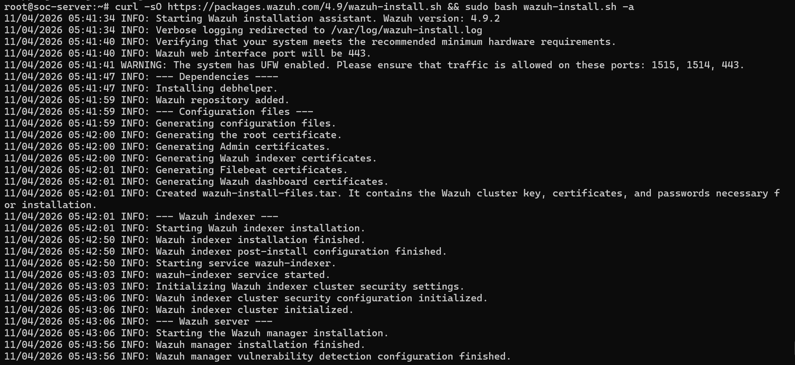
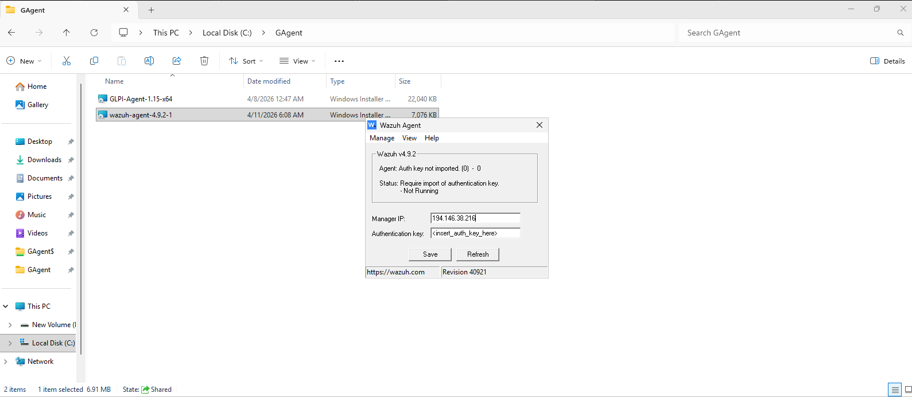
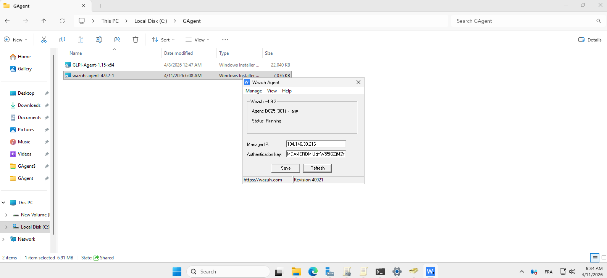
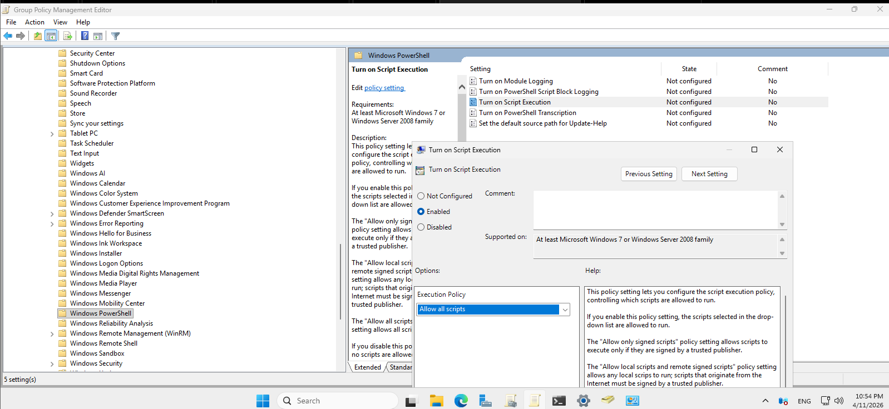
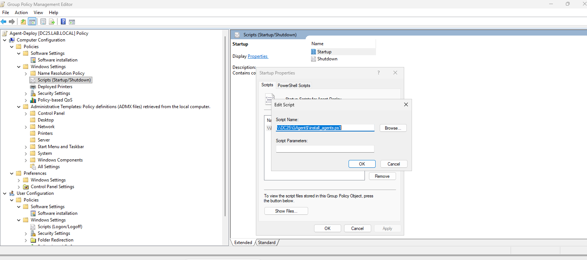

# 🛡️ Déploiement de Wazuh — Installation Serveur & Déploiement Agent via GPO

> **Environnement :** Serveur Linux (`soc-server`) · Active Directory (domaine `lab.local`) · DC25 (Windows Server 2025) · Clients Windows 10 Pro · Wazuh version **4.9.2**

---

## Table des matières

1. [Ouverture des ports UFW sur le serveur SOC](#1-ouverture-des-ports-ufw-sur-le-serveur-soc)
2. [Installation automatique de Wazuh via script](#2-installation-automatique-de-wazuh-via-script)
3. [Accès à l'interface web Wazuh](#3-accès-à-linterface-web-wazuh)
4. [Installation manuelle de l'agent Wazuh sur le DC (AD)](#4-installation-manuelle-de-lagent-wazuh-sur-le-dc-ad)
5. [Connexion confirmée de l'agent Wazuh — DC25](#5-connexion-confirmée-de-lagent-wazuh--dc25)
6. [Configuration GPO — Autorisation d'exécution PowerShell](#6-configuration-gpo--autorisation-dexécution-powershell)
7. [Déploiement GPO — Script PowerShell de démarrage](#7-déploiement-gpo--script-powershell-de-démarrage)

---

## 1. Ouverture des ports UFW sur le serveur SOC

**Serveur :** `soc-server` (Linux Ubuntu)

Avant toute installation, les ports nécessaires au fonctionnement de Wazuh doivent être ouverts dans le pare-feu UFW.

**Ports à ouvrir :**

| Port | Protocole | Usage |
|------|-----------|-------|
| **1514** | TCP | Communication agents → manager (événements) |
| **1515** | TCP | Enregistrement des agents |
| **443** | TCP | Interface web Wazuh Dashboard (HTTPS) |

**Commandes exécutées :**

```bash
sudo ufw allow 1514/tcp
sudo ufw allow 1515/tcp
sudo ufw allow 443/tcp
```

> ℹ️ Le message `Skipping adding existing rule` indique que la règle était déjà présente — les ports sont bien ouverts.


---

## 2. Installation automatique de Wazuh via script

**Serveur :** `root@soc-server`

Wazuh propose un script d'installation tout-en-un (`-a` pour *all-in-one*) qui installe et configure automatiquement tous les composants : **Wazuh Indexer**, **Wazuh Manager** et **Wazuh Dashboard**.

**Commande d'installation :**

```bash
curl -sO https://packages.wazuh.com/4.9/wazuh-install.sh && sudo bash wazuh-install.sh -a
```

**Déroulement de l'installation (journal) :**

| Étape | Description |
|-------|-------------|
| Vérification matérielle | Contrôle des prérequis minimum |
| Port web | Interface Wazuh sur le port **443** |
| Avertissement UFW | Rappel d'ouvrir les ports 1515, 1514, 443 |
| Dépendances | Installation de `debhelper` |
| Dépôt Wazuh | Ajout du dépôt officiel |
| Certificats | Génération des certificats root, Admin, Indexer, Filebeat, Dashboard |
| Archive | Création de `wazuh-install-files.tar` (clés, certificats, mots de passe) |
| **Wazuh Indexer** | Installation + post-configuration + démarrage du service |
| Cluster | Initialisation de la sécurité et du cluster Wazuh Indexer |
| **Wazuh Manager** | Installation + configuration de la détection de vulnérabilités |

> 💡 Les identifiants générés à la fin de l'installation (admin/password) sont à noter impérativement — ils donnent accès au Dashboard.



---

## 3. Accès à l'interface web Wazuh

Une fois l'installation terminée, l'interface web Wazuh Dashboard est accessible via HTTPS.

**URL d'accès :** `https://<IP_du_serveur>` (port 443)

**Identifiants par défaut :**

| Champ | Valeur |
|-------|--------|
| Username | `admin` |
| Password | *(généré durant l'installation — visible dans le terminal)* |

> ⚠️ Le navigateur affichera un avertissement de certificat auto-signé — accepter l'exception pour continuer.


---

## 4. Installation manuelle de l'agent Wazuh sur le DC (AD)

**Machine :** `DC25` — Contrôleur de domaine Windows Server 2025

L'agent Wazuh est installé **manuellement** sur le DC car celui-ci ne reçoit pas les GPO de déploiement destinées aux postes clients.

**Fichier utilisé :** `wazuh-agent-4.9.2-1.msi` (7,076 KB) — placé dans `C:\GAgent`

**Étapes :**
1. Double-cliquer sur `wazuh-agent-4.9.2-1.msi` pour lancer l'installation.
2. Une fois installé, ouvrir l'interface **Wazuh Agent** (depuis le menu Démarrer ou le dossier d'installation).
3. Renseigner l'**IP du Manager** : `194.146.38.216`
4. Laisser le champ **Authentication key** vide pour l'instant (`<insert_auth_key_here>`).
5. Cliquer sur **Save**.

**État initial :**

```
Agent: Auth key not imported. (0) - 0
Status: Require import of authentication key.
       - Not Running
```

> ⚠️ L'agent ne démarre pas tant que la clé d'authentification n'a pas été importée depuis le Manager Wazuh.



---

## 5. Connexion confirmée de l'agent Wazuh — DC25

Après import de la clé d'authentification générée par le Manager Wazuh, l'agent est correctement enregistré et opérationnel.

**Récupération de la clé d'authentification sur le serveur :**

```bash
sudo /var/ossec/bin/manage_agents
# Choisir option E (Extract key for an agent)
# Sélectionner l'agent DC25 et copier la clé générée
```

**Configuration finale de l'agent :**

| Champ | Valeur |
|-------|--------|
| Manager IP | `194.146.38.216` |
| Authentication key | `MDAxERDMjUgYW55lGZjMZY` *(exemple)* |

**État après enregistrement :**

```
Agent: DC25 (001) - any
Status: Running
```

✅ L'agent DC25 est bien connecté au Manager Wazuh et transmet ses événements.



---

## 6. Configuration GPO — Autorisation d'exécution PowerShell

**Outil :** Group Policy Management Editor  
**GPO ciblée :** `Agent-Deploy` (OU PEAKY-BLINDERS)

Pour permettre l'exécution du script PowerShell de déploiement sur les postes clients, la politique d'exécution PowerShell doit être activée via GPO.

**Chemin GPO :**
```
Computer Configuration > Administrative Templates > Windows Components > Windows PowerShell
```

**Paramètre à configurer :** `Turn on Script Execution`

**Configuration appliquée :**

| Paramètre | Valeur |
|-----------|--------|
| État | **Enabled** |
| Execution Policy | **Allow all scripts** |

**Étapes :**
1. Dans la GPO `Agent-Deploy`, naviguer vers **Computer Configuration** → **Administrative Templates** → **Windows Components** → **Windows PowerShell**.
2. Double-cliquer sur **Turn on Script Execution**.
3. Sélectionner **Enabled**.
4. Dans le menu déroulant **Execution Policy**, choisir **Allow all scripts**.
5. Cliquer sur **OK**.

> ⚠️ Sans cette configuration, le script PowerShell de déploiement sera bloqué par la politique d'exécution restrictive par défaut de Windows.



---

## 7. Déploiement GPO — Script PowerShell de démarrage

**GPO :** `Agent-Deploy [DC25.LAB.LOCAL]`  
**Section :** `Computer Configuration > Policies > Windows Settings > Scripts (Startup/Shutdown)`

Un script PowerShell est configuré pour s'exécuter au **démarrage** des postes clients, assurant l'installation automatique et silencieuse de l'agent Wazuh sur toutes les machines de l'OU.

**Chemin GPO :**
```
Computer Configuration > Policies > Windows Settings > Scripts (Startup/Shutdown) > Startup
```

**Configuration du script :**

| Champ | Valeur |
|-------|--------|
| **Script Name** | `\\DC25\GAgent$\install_agents.ps1` |
| **Script Parameters** | *(aucun — les paramètres sont intégrés dans le script)* |

**Contenu type du script `install_agents.ps1` :**

```powershell
# Installation silencieuse de l'agent Wazuh
$WazuhManager = "194.146.38.216"
$MSIPath = "\\DC25\GAgent$\wazuh-agent-4.9.2-1.msi"

# Vérifier si l'agent est déjà installé
if (-not (Get-Service -Name "WazuhSvc" -ErrorAction SilentlyContinue)) {
    Start-Process msiexec.exe -ArgumentList `
        "/i `"$MSIPath`" /quiet WAZUH_MANAGER=`"$WazuhManager`" WAZUH_REGISTRATION_SERVER=`"$WazuhManager`"" `
        -Wait -NoNewWindow
}
```

**Étapes de configuration dans la GPO :**
1. Dans la GPO `Agent-Deploy`, aller dans **Computer Configuration** → **Policies** → **Windows Settings** → **Scripts (Startup/Shutdown)**.
2. Double-cliquer sur **Startup**.
3. Dans l'onglet **PowerShell Scripts**, cliquer sur **Add...**.
4. Dans le champ **Script Name**, saisir : `\\DC25\GAgent$\install_agents.ps1`
5. Laisser **Script Parameters** vide.
6. Cliquer sur **OK** → **Apply**.

> 💡 Le script est placé dans le partage `GAgent$` (partage caché) sur le DC25, accessible par tous les postes du domaine. L'utilisation de **Computer Configuration** (et non User Configuration) garantit l'exécution au démarrage machine, indépendamment de l'utilisateur connecté.




