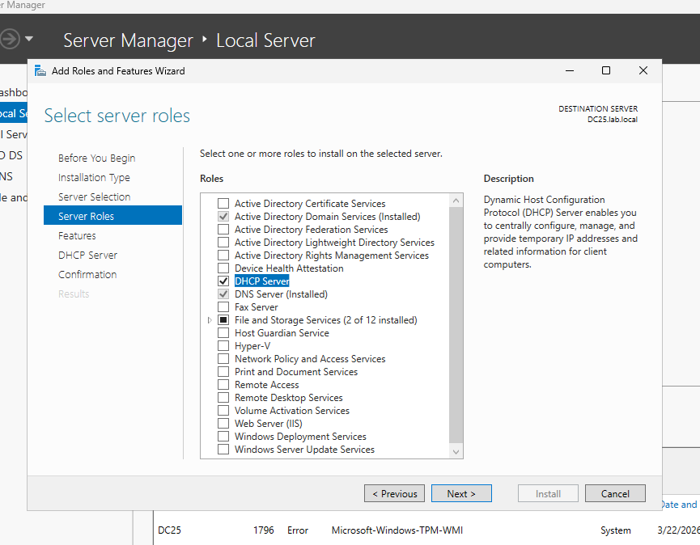
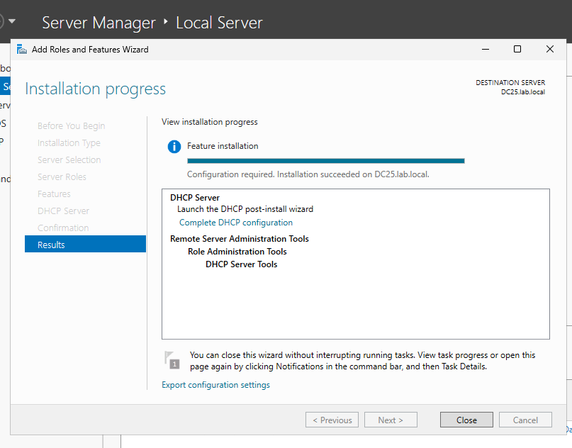
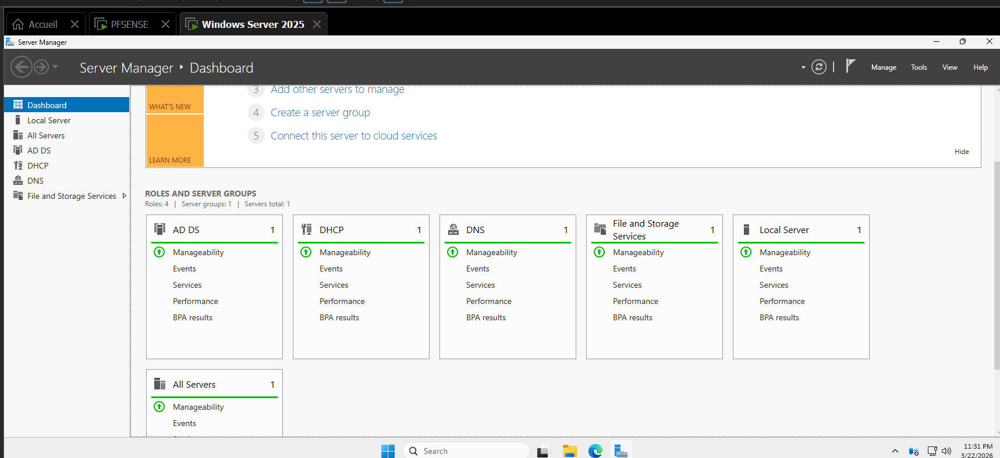
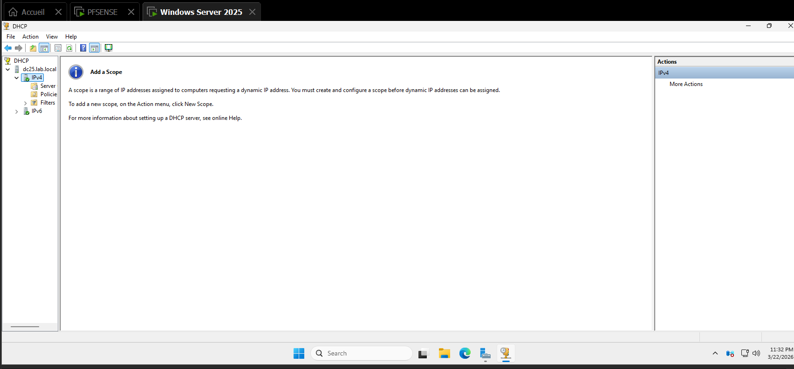
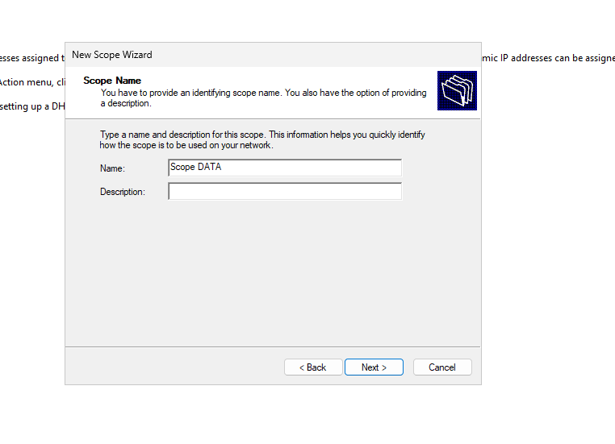
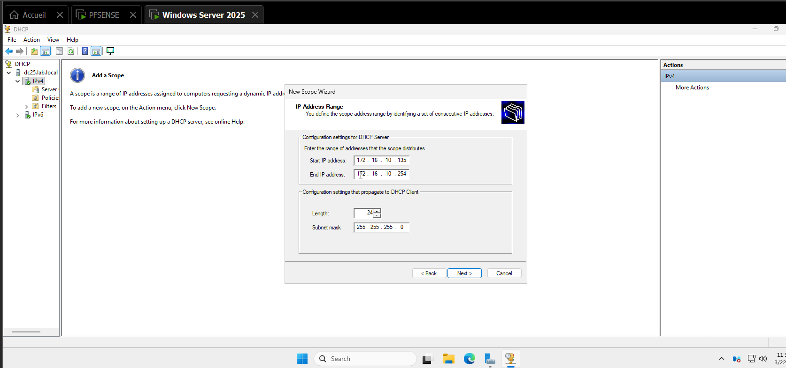
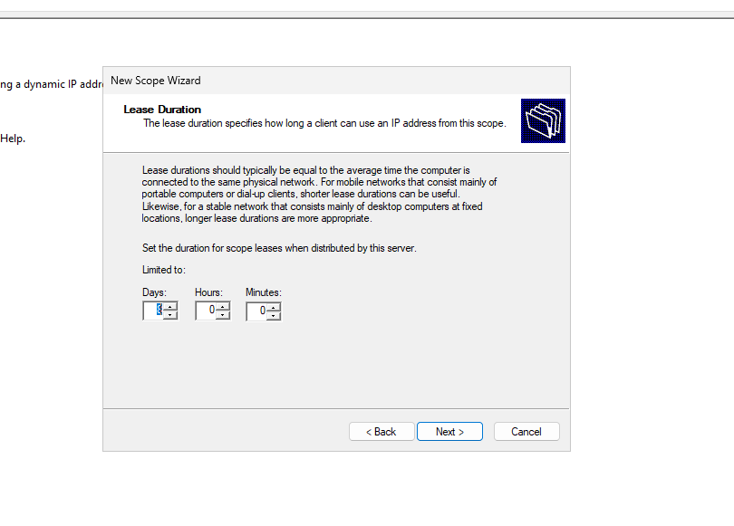
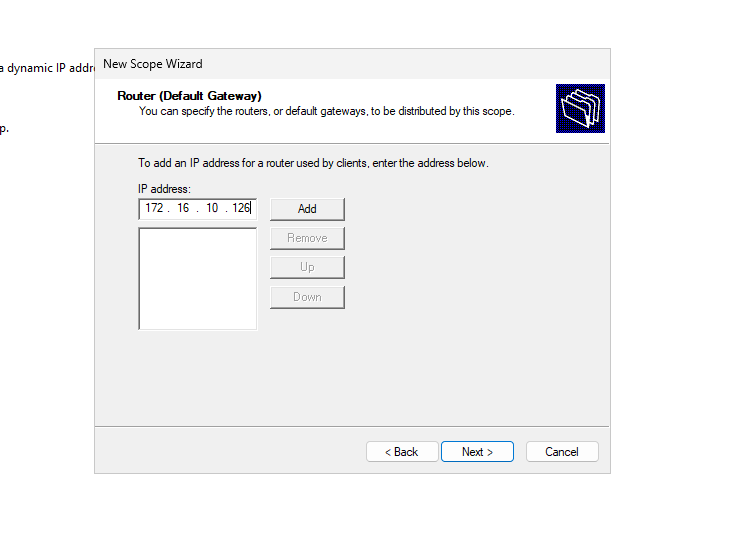
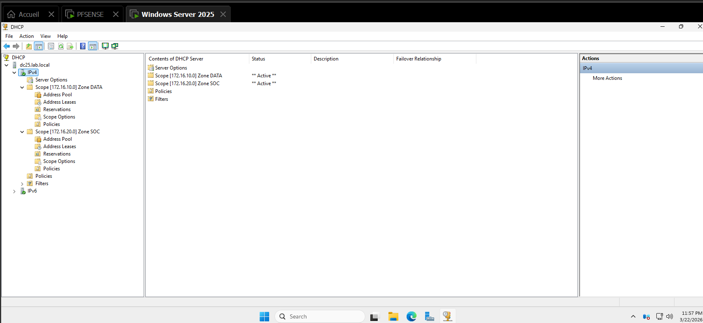

# 📡 Installation et Configuration du Serveur DHCP — Windows Server 2025


## 1. Installation du rôle DHCP Server

Depuis le **Server Manager**, lancer l'assistant **Add Roles and Features** :

- Naviguer jusqu'à l'étape **Server Roles**
- Cocher **DHCP Server** dans la liste des rôles disponibles
- Les rôles déjà installés (Active Directory Domain Services, DNS Server) sont visibles et cochés
- La description confirme : le rôle DHCP permet de configurer, gérer et distribuer des adresses IP temporaires aux machines clientes

> Le serveur de destination est **DC25.lab.local**.



---

## 2. Finalisation de l'installation

Une fois les étapes de l'assistant validées, l'installation démarre automatiquement.

- La barre de progression indique **Feature installation**
- Le message **"Installation succeeded on DC25.lab.local"** confirme le succès
- Les composants installés sont :
  - **DHCP Server**
  - **Remote Server Administration Tools → Role Administration Tools → DHCP Server Tools**
- Un lien **"Complete DHCP configuration"** est proposé pour lancer le post-install wizard

> Il est recommandé de cliquer sur **"Complete DHCP configuration"** afin d'autoriser le serveur DHCP dans Active Directory (autorisation DHCP).



---

## 3. Vérification dans le Server Manager Dashboard

Après installation, le **Dashboard** du Server Manager affiche désormais **4 rôles actifs** :

| Rôle | Statut |
|------|--------|
| AD DS | ✅ Manageability OK |
| DHCP | ✅ Manageability OK |
| DNS | ✅ Manageability OK |
| File and Storage Services | ✅ Manageability OK |

Le panneau de navigation gauche liste bien **DHCP** comme rôle accessible directement.



---

## 4. Ouverture de la console DHCP et création d'une étendue

Accéder à la console DHCP via **Tools → DHCP** depuis le Server Manager (ou `dhcpmgmt.msc`).

Dans l'arborescence :

```
DHCP
└── dc25.lab.local
    ├── IPv4        ← Sélectionner ici
    └── IPv6
```

Le panneau central indique qu'**aucune étendue n'est encore configurée** et explique :

> *"A scope is a range of IP addresses assigned to computers requesting a dynamic IP address. You must create and configure a scope before dynamic IP addresses can be assigned."*

**Pour créer une nouvelle étendue :**

- Faire un clic droit sur **IPv4** (ou via le menu **Action**)
- Cliquer sur **New Scope...**



---

## 5. Nommage de l'étendue (Scope)

L'assistant **New Scope Wizard** s'ouvre. La première étape demande de renseigner un **nom** et une **description** pour identifier l'étendue sur le réseau.

| Champ | Valeur saisie |
|-------|---------------|
| **Name** | `Scope DATA` |
| **Description** | *(optionnel)* |

> Le nom choisi est `Scope DATA`, ce qui permet d'identifier facilement que cette étendue est dédiée au réseau DATA.

Cliquer sur **Next >** pour passer à la configuration de la plage d'adresses IP.



---

## 6. Définition de la plage d'adresses IP

L'étape **IP Address Range** permet de définir la plage d'adresses que le serveur DHCP distribuera aux clients.

| Paramètre | Valeur |
|-----------|--------|
| **Start IP address** | `172.16.10.135` |
| **End IP address** | `172.16.10.254` |
| **Length (préfixe)** | `24` |
| **Subnet mask** | `255.255.255.0` |

> La plage commence à `.135` pour réserver les adresses `.1` à `.134` à des équipements à adressage statique (serveurs, imprimantes, switchs, etc.).  
> Le masque `/24` est automatiquement calculé dès la saisie du préfixe.

Cliquer sur **Next >** pour continuer.



---

## 7. Durée des baux DHCP

L'étape **Lease Duration** définit la durée pendant laquelle un client peut conserver l'adresse IP qui lui a été assignée.

| Paramètre | Valeur configurée |
|-----------|-------------------|
| **Days** | `8` |
| **Hours** | `0` |
| **Minutes** | `0` |

> Une durée de **8 jours** est adaptée à un réseau stable composé principalement de postes fixes. Pour un réseau Wi-Fi ou à forte rotation, une durée plus courte (ex. 1 jour) est préférable.

Cliquer sur **Next >** pour continuer.



---

## 8. Passerelle par défaut (Default Gateway)

L'étape **Router (Default Gateway)** permet de renseigner l'adresse IP de la passerelle que les clients DHCP utiliseront pour atteindre d'autres réseaux.

| Paramètre | Valeur |
|-----------|--------|
| **IP address (gateway)** | `172.16.10.126` |

**Procédure :**

1. Saisir l'adresse `172.16.10.126` dans le champ **IP address**
2. Cliquer sur **Add** pour l'ajouter à la liste
3. Cliquer sur **Next >** pour continuer

> L'adresse `172.16.10.126` correspond à l'interface de la **zone DATA** sur le routeur/pare-feu (pfSense dans cet environnement).



---

## 9. Résultat final — Étendues actives

Une fois les deux étendues créées et activées, la console DHCP affiche la configuration complète sous **IPv4** :

| Étendue | Réseau | Statut |
|---------|--------|--------|
| **Zone DATA** | `172.16.10.0` | ✅ Active |

L'arborescence de chaque étendue contient les sous-dossiers standards :

```
Scope [172.16.10.0] Zone DATA
├── Address Pool
├── Address Leases
├── Reservations
├── Scope Options
└── Policies
```

> L'étendue est **active**, permettant la distribution automatique d'adresses IP dans la zone réseau DATA.



---


## Remarques

- Les adresses `.1` à `.134` de la zone DATA sont réservées aux équipements statiques (serveurs, switchs, pare-feu).

---

