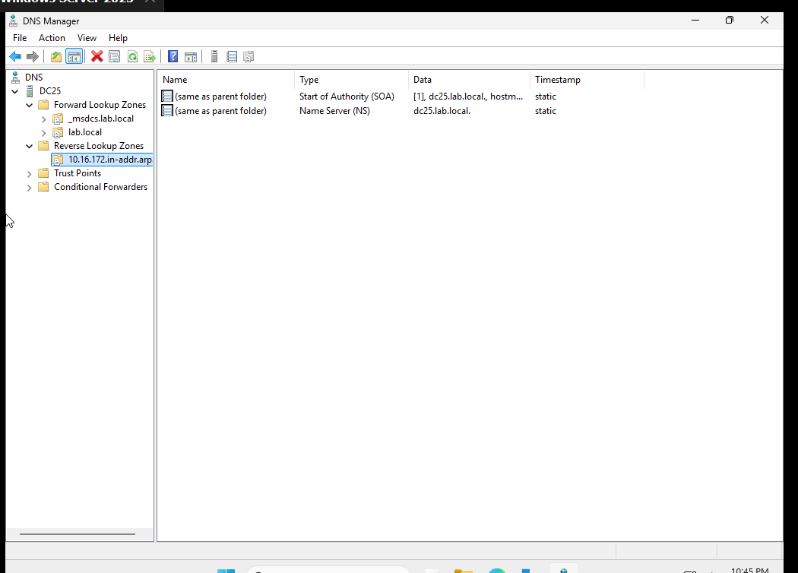
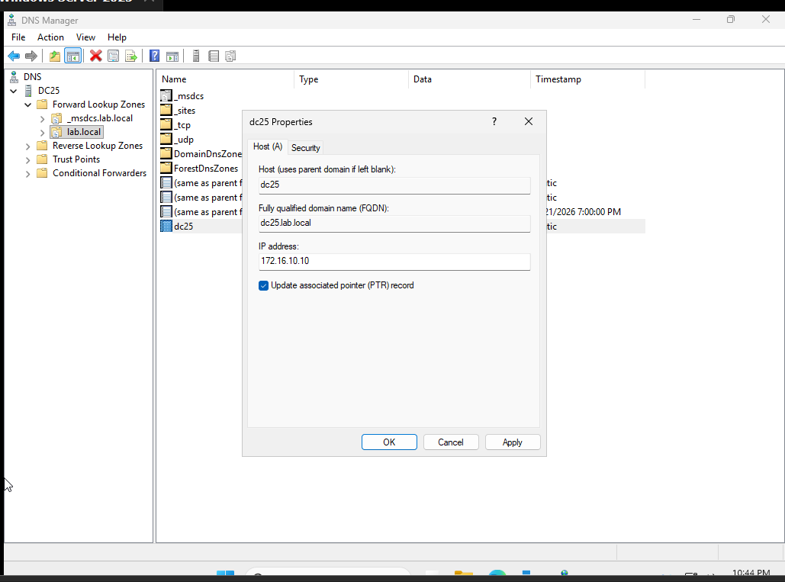
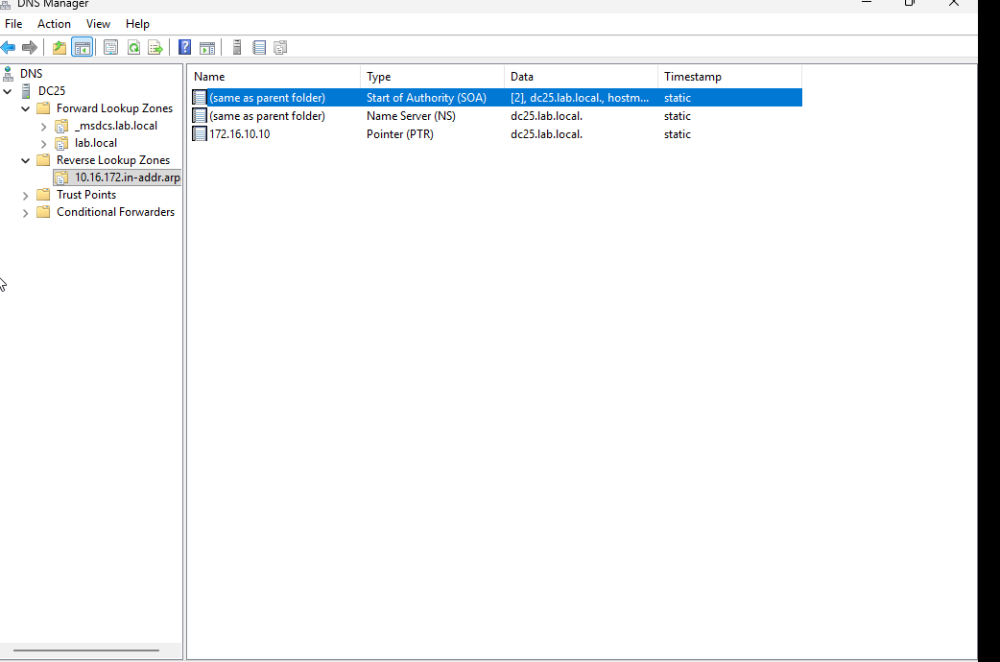
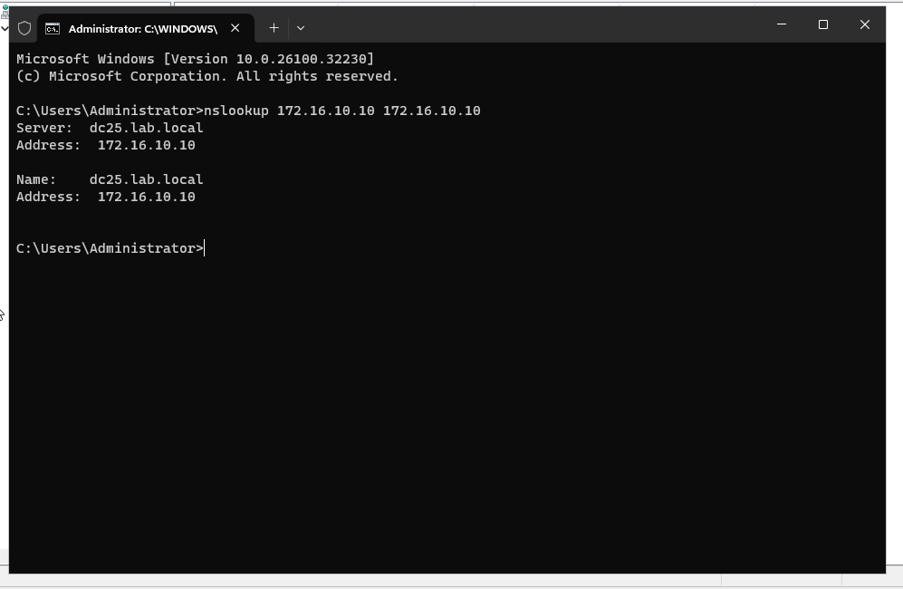
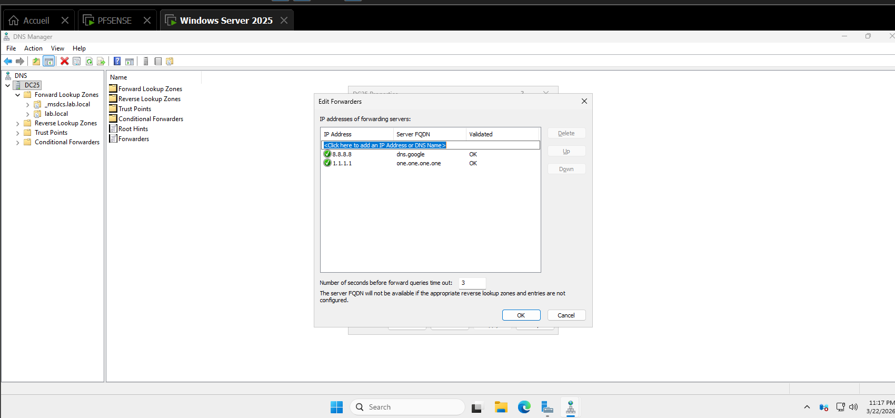

# 🌐 Configuration du Service DNS - Infrastructure Lab SSI

Ce document détaille la mise en place du service DNS sur le serveur **DC25** pour la gestion du domaine `lab.local`. La configuration suit une approche structurée incluant la création des zones et la validation de la résolution.

## 1. Création de la Zone de Recherche Inversée
La zone de recherche inversée est la première étape pour permettre la résolution d'adresses IP en noms d'hôtes.
* **Structure** : La zone a été créée pour le sous-réseau du laboratoire sous l'arborescence `10.16.172.in-addr.arpa`.
* **Enregistrements de base** : Elle contient initialement les enregistrements de type SOA (Start of Authority) et NS (Name Server).

## 2. Mise à jour du Pointeur (PTR)
Une fois la zone inversée disponible, l'enregistrement de l'hôte principal est mis à jour pour assurer la cohérence bidirectionnelle.
* **Configuration de l'hôte** : Dans les propriétés de l'enregistrement `dc25`, l'option "Update associated pointer (PTR) record" est cochée.
* **Liaison IP** : Cette action lie statiquement l'adresse `172.16.10.10` au nom FQDN `dc25.lab.local` dans la zone inversée.

## 3. Vérification de l'enregistrement PTR
Après la mise à jour, nous vérifions que le pointeur est bien apparu dans la zone de recherche inversée.
* **Validation visuelle** : L'enregistrement de type **Pointer (PTR)** est désormais présent et pointe correctement vers `dc25.lab.local`.

## 4. Validation Technique (NSLOOKUP)
Le bon fonctionnement de la résolution est confirmé par un test en ligne de commande.
* **Test de résolution** : La commande `nslookup 172.16.10.10 172.16.10.10` interroge directement le serveur local.
* **Résultat** : Le serveur renvoie le nom `dc25.lab.local`, prouvant que la configuration des zones est opérationnelle.

## 5. Configuration des Redirecteurs (Forwarders)
Pour permettre la navigation Internet tout en conservant le contrôle DNS interne, des redirecteurs externes sont ajoutés.
* **Serveurs DNS Externes** : Utilisation des services de Google (`8.8.8.8`) et Cloudflare (`1.1.1.1`).
* **État de validation** : Les deux serveurs sont validés avec succès (État OK) par le gestionnaire DNS.

---
