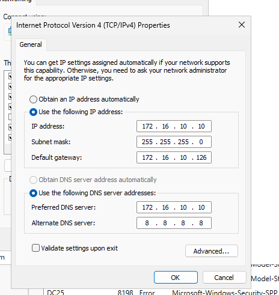
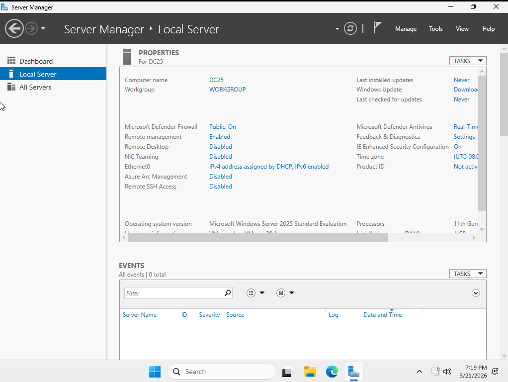
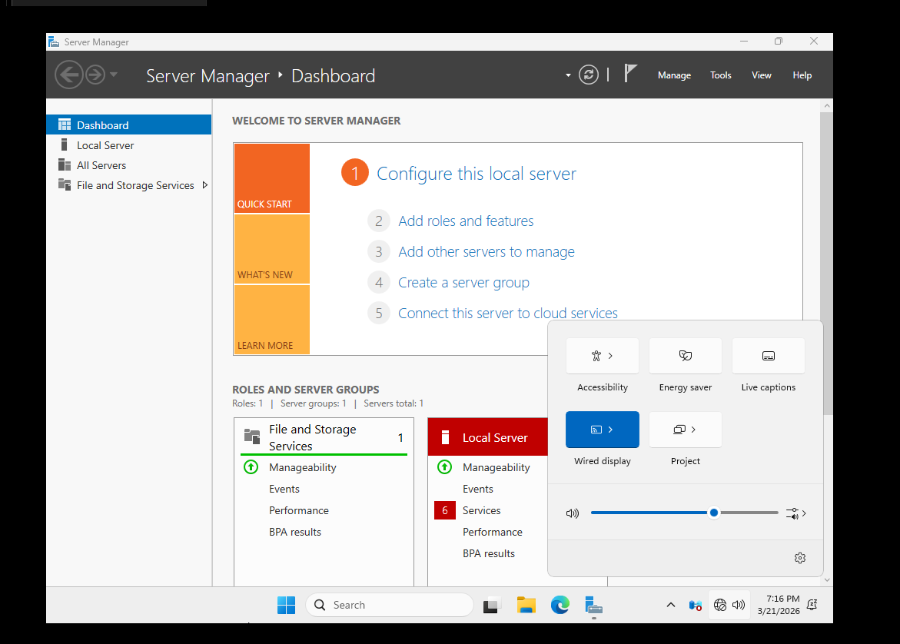
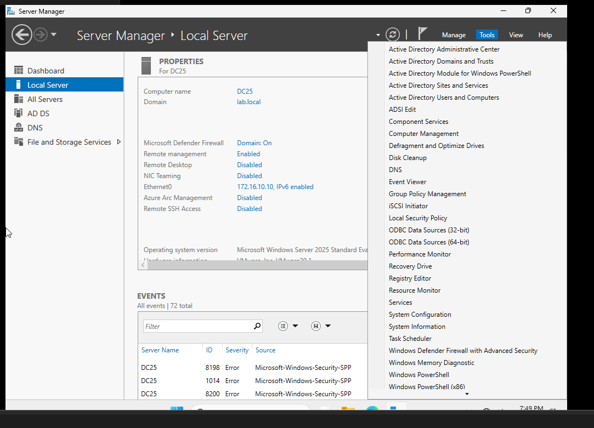
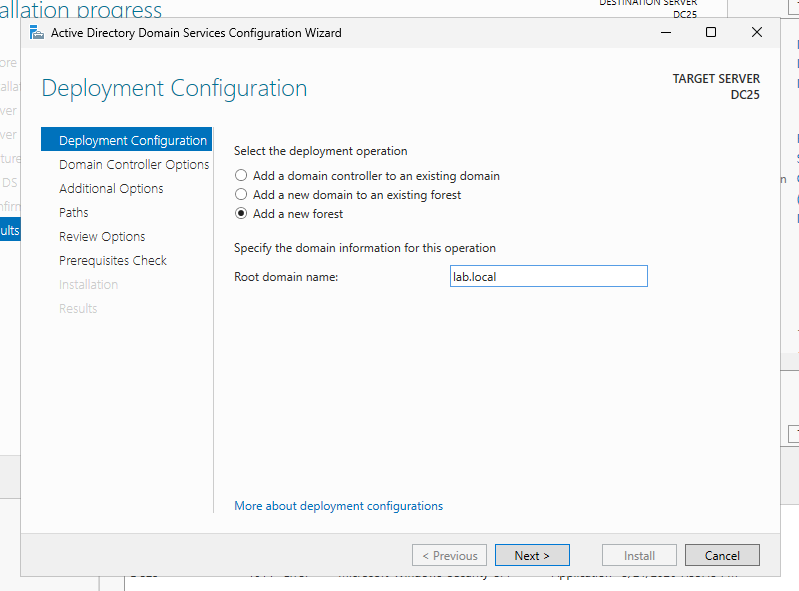
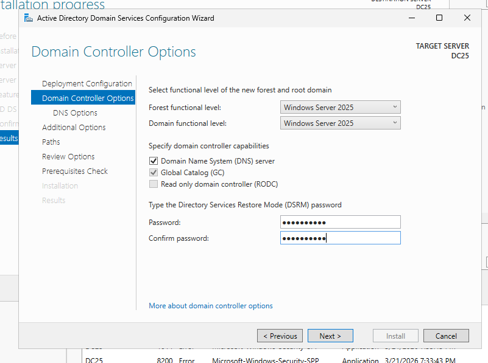
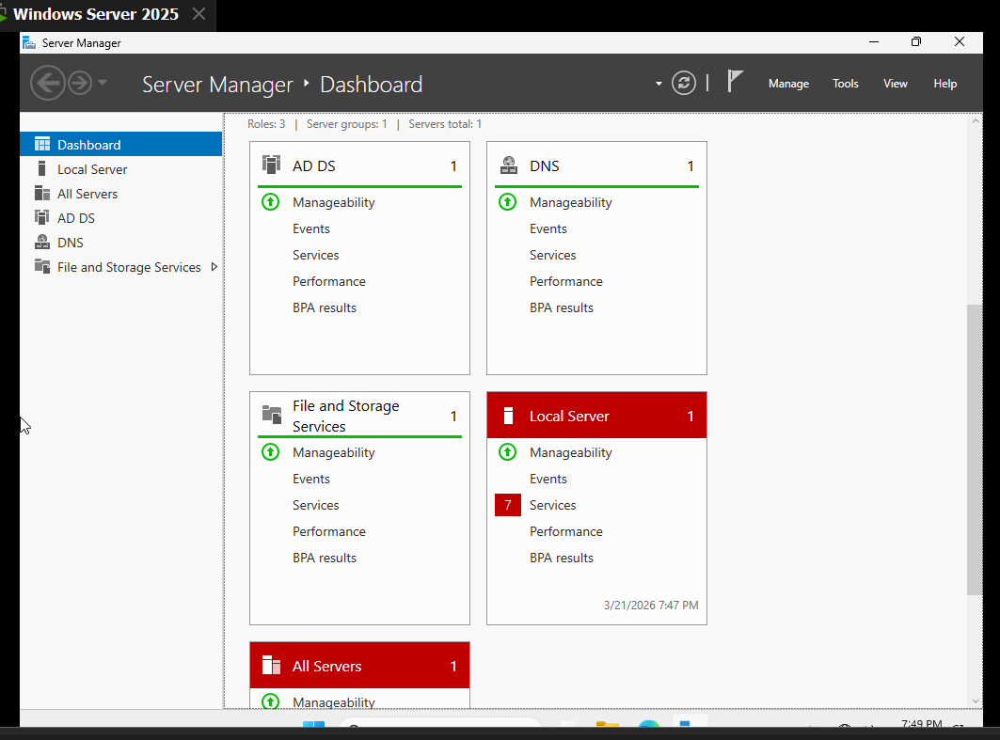
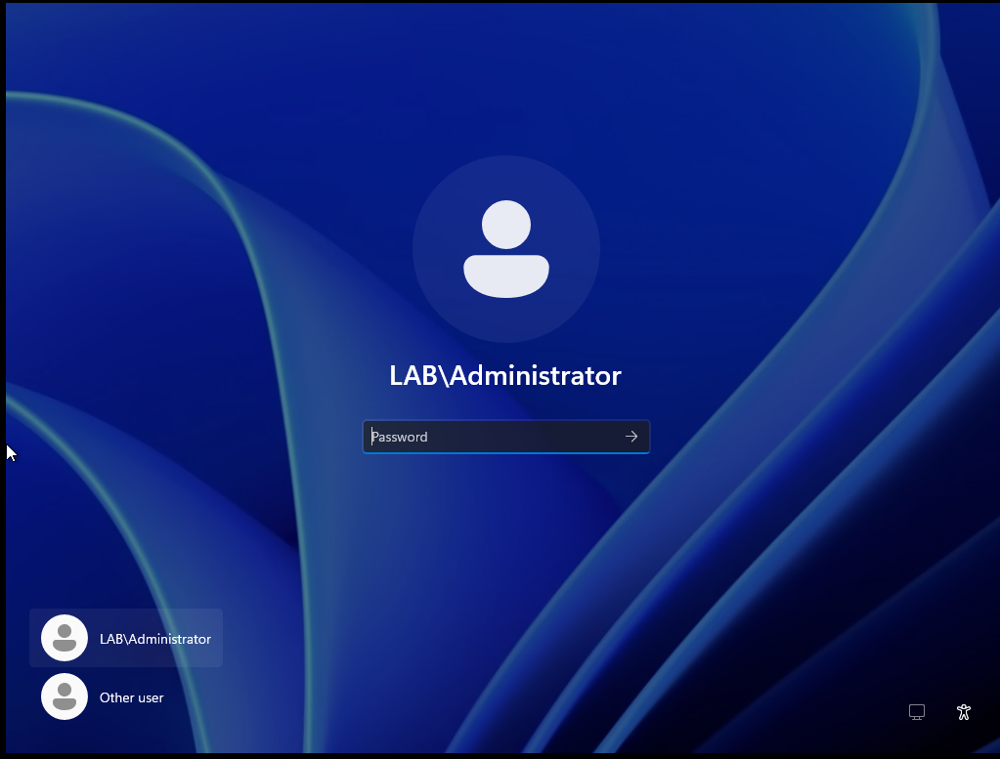

# 📂 Configuration de l'Active Directory (DC25)

Ce document détaille la mise en place du contrôleur de domaine central de l'infrastructure. Le serveur **DC25** assure la gestion des identités (AD DS), la résolution de noms (DNS) et l'adressage dynamique (DHCP).

## 🛠️ 1. Préparation du Système
Avant l'installation des rôles, le serveur a été configuré pour garantir une identité fixe et cohérente sur le segment `172.16.10.0/24`.

### 1.1 Adressage IP Statique
Le serveur est configuré avec une adresse IP immuable pour éviter toute rupture de service des rôles AD et DNS.
* **Adresse IP** : `172.16.10.10`
* **Masque de sous-réseau** : `255.255.255.0`
* **Passerelle par défaut** : `172.16.10.126` (Interface pfSense)
* **Serveur DNS** : `127.0.0.1` (Boucle locale)

### 1.2 Renommage de la machine
Pour respecter la nomenclature du laboratoire, le nom générique du serveur a été modifié en **DC25**.

---

## 🏗️ 2. Installation des Services de Domaine (AD DS)
L'installation a été réalisée via le "Gestionnaire de serveur" (Server Manager).

### 2.1 Sélection et installation des rôles
Le rôle **Active Directory Domain Services** ainsi que les outils d'administration ont été sélectionnés.

### 2.2 Confirmation de l'état des services
Le tableau de bord initial (avant promotion) montre les services prêts à être configurés.

Une fois les binaires installés, le système demande une configuration post-déploiement (Promotion).

---

## 🚀 3. Promotion en Contrôleur de Domaine
Cette phase transforme le serveur en un véritable contrôleur de domaine pour une nouvelle forêt.

### 3.1 Définition du domaine racine
Le domaine choisi pour ce laboratoire est **`lab.local`**.

### 3.2 Configuration du DSRM
Le mot de passe de récupération des services d'annuaire (DSRM) a été configuré. Ce mot de passe est vital pour la maintenance de la base de données Active Directory en mode hors-ligne.

---

## ✅ 4. Validation et État Final
Après redémarrage, le serveur est devenu le contrôleur de domaine de la forêt `lab.local`.

### 4.1 Dashboard après promotion
Le gestionnaire de serveur affiche désormais les rôles **AD DS** et **DNS** en état de fonctionnement (voyants verts).

### 4.2 Vérification de la structure du domaine
L'annuaire est prêt à être administré. La racine du domaine `lab.local` est visible et fonctionnelle.

---

## 🛡️ Justification SSI (Sécurité)
1. **Centralisation des identités** : Permet l'application de stratégies de mots de passe (GPO) et le contrôle d'accès basé sur les rôles (RBAC).
2. **DNS Interne** : Masquage de la topologie interne du réseau vis-à-vis de l'Internet public (RFC 1918).
3. **Point d'audit** : Le DC25 constitue la source principale de logs d'authentification pour la détection de mouvements latéraux ou d'attaques par force brute.